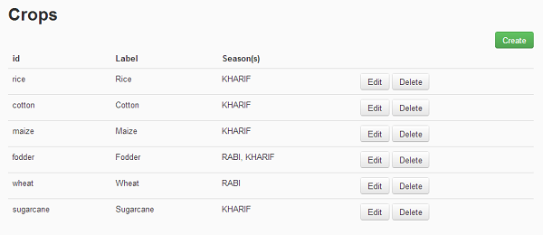
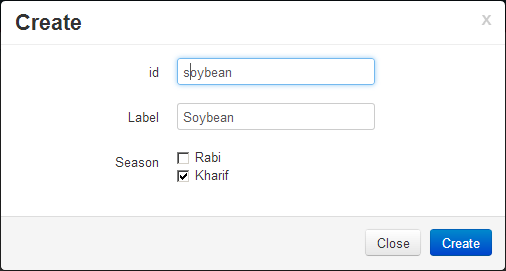
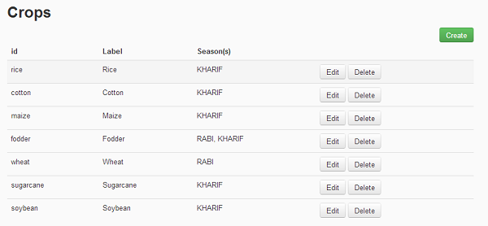
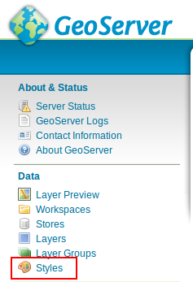

.. module:: cippak.admin.crop_agro
   :synopsis: Learn about how to manage Crops and Agromet factors.

.. _cippak.admin.crop_agro:

=========================
Crops and Agromet factors 
=========================

Manage Crops
============
To manage Crops you must click on the **Crops** link in the navigation bar:

    The list of available crops

.. raw:: latex

  \newpage % hard pagebreak at exactly this position   

-----------------
Create a new Crop
-----------------

To create a new crop, click on the **Create** button. 
A form with the information to set will be displayed. 
complete the form as follows:

    Sample Soybean crop
    
The new crop will be shown in the Crops list.

    The new crop is added to the list
    
Anyway the new crop will not be available in MapStore until some data about the crop is ingested.

^^^^^^^^^^^^^^^^^^^^^^^^^^^^^^^^^^^^^^^^^
How to allow map generation for new Crops
^^^^^^^^^^^^^^^^^^^^^^^^^^^^^^^^^^^^^^^^^

To generate maps you **must** add 6 new styles to geoserver with a specific name::

    <province|district>_<crop_id_lower_case>_<area|prod|yield>_style

In the case above the styles to add will have the following names:

* ``province_soybean_area_style``
* ``province_soybean_prod_style``
* ``province_soybean_yield_style``
* ``district_soybean_area_style``
* ``district_soybean_prod_style``
* ``district_soybean_yield_style``

.. note:: This styles are needed to generate maps in the *Crop Data* module of *MapStore*.

        * Area Type: National(Province)
            * ``province_soybean_area_style.xml``:  style to generate maps for area.
            * ``province_soybean_prod_style.xml``:  style to generate maps for production.
            * ``province_soybean_yield_style.xml``: style to generate maps for yield.
        
        * Area Type: National(District) or Province(District)
            * ``district_soybean_area_style.xml``:  style to generate maps for area .
            * ``district_soybean_prod_style.xml``:  style to generate maps for production.
            * ``district_soybean_yield_style.xml``: style to generate maps for yield.
            
+++++++++++++++
Add a SLD style
+++++++++++++++

You can access to the style layer descriptor (SLD) definition page on GeoServer selecting *Styles* module on GeoServer:

    Styles module on GeoServer

.. raw:: latex

  \newpage % hard pagebreak at exactly this position   

and press on *add a new style*

.. figure:: img/styles_add.png

    Add a new style button

Now, you have to fill the form with the new name, 

for this exercise you can copy a style from the existing ones. :

.. figure:: img/styles_copy.png

    Copy *province_cotton_area_style*

change the style with the new name and modify filters as you want:

copy from one of the present one:

.. figure:: img/styles_edit.png

    Edit the style

.. raw:: latex

  \newpage % hard pagebreak at exactly this position   

validate and submit the new style:

.. figure:: img/styles_submit.png

    Styles submit

-----------------
Edit/Delete Crops
-----------------

You can edit/delete the crops clicking on the **Edit** and **Delete** buttons on the right of each row.

.. raw:: latex

  \newpage % hard pagebreak at exactly this position   

Manage Agrometeorological Factors
=================================
To manage Agrometeorological Factors you can click on the **Agromet Factors** link in the navigation bar.

.. figure:: img/factor_list.png

    The list of available factors

-------------------
Create a new Factor
-------------------

To create a new factor, click on the **Create** button. 
A form with the information to set will be displayed. 
complete the form as follows:

.. figure:: img/factor_create.png

    Sample Evapotranspiration factor

.. raw:: latex

  \newpage % hard pagebreak at exactly this position   
    
The new factor will be shown in the Crops list.

.. figure:: img/factor_list2.png

    The new factor is added to the list
    
Anyway the new factor will not be available in MapStore until some data about the factor is ingested.

-------------------
Edit/Delete Factors
-------------------

You can edit/delete the factor clicking on the **Edit** and **Delete** buttons on the right of each row.