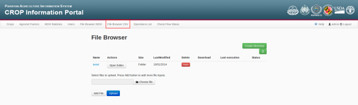
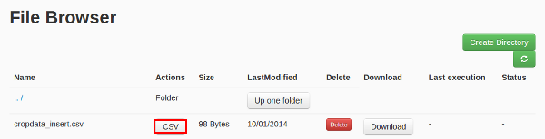

.. module:: cippak.admin.csv
   :synopsis: Learn about how to ingest from CSV files and download generated data.

.. _cippak.admin.csv:

.. raw:: latex

  \newpage % hard pagebreak at exactly this position   

CSV Browser 
===========

This section explain how to use CSV Browser to allow:

* Create
* Update
* Delete

records on agromet, crop data and crop status tables. This allows to publish dekadal values for *Agromet* module, yearly values for *Crop Data* module and thresholds to use in the *Crop Status* module. 

To access to this module you need to click on the navigation bar button 'File Browser CSV'

   CSV Browser on navigation bar.

Now you can upload your files to launch the ingestion. The file operation and the target table depends on the CSV files you upload.

Known CSV formats
-----------------

The target table depends on header row of the CSV file to be ingested and can be:

* Agromet
* Crop data
* Crop status

Agromet
+++++++

The header for an agromet operation must be::

	*,distr,prov,year,mon,dec,factor,*

and the values must be correct values for the database. For example::

	rowId,distr,prov,year,mon,dec,factor,NDVI_avg
	,Bolan,BALOCHISTAN,2013,Jan,1,fake_arg,100
	2,Bolan,BALOCHISTAN,2013,Feb,1,fake_arg,200

.. note:: The **value** element is the measured value in that region during the period of time indicated expressed in the unit of measurement provided in the ``agromet_descriptor``

The first column is ignored, the columns 'distr', 'prov', 'year', 'mon', 'dec' and 'factor' are the composed primary key of the database and the last column is the value of the agromet factor.

Crop Data
+++++++++

The header for a crop data operation must be::

	*,crop,distr,prov,year,years,area,prod,yield

and the values must be correct values for the database. For example::

	id,crop,distr,prov,year,years,area,prod,yield
	dummy,rice,fake_dist,fake_prov,2000,2000-2005,1,1,1

.. note::   * *area*: planted area for that region during the year and for the commodity indicated
            * *prod*: production for that region during the year and for the commodity indicated
            * *yield*: yield of the crop for that region during the year

The first column is ignored and the other columns are the cropdata table columns. The primary key is composed by columns: 'crop', 'district', 'province' and 'year'.

Crop status
+++++++++++

The header for a crop status operation must be::

	*,factor,crop,month,dec,max,min,opt,

and the values must be correct values for the database. For example::

	rowid,factor,crop,month,dec,max,min,opt,
	1,"Tmax_avg","fake_crop_2","Apr",1,16,42,15,20
	1,"Tmax_avg","fake_crop_2","May",1,16,42,15,20

.. note::   * *max*: the maximum value to show in Crop Status module for the dekad and the crop
            * *min*: the minimum value to show in Crop Status module for the dekad and the crop
            * *opt*: optimal value (dashed in Crop Status charts)

The first column is ignored and the other columns are the cropdata table columns. The primary key of this table is composed by: 'crop', 'month', 'factor' and 'dec' columns.

Operations
----------

To apply changes to the data (insert, update, delete) you have do run the CSV operation to a csv file :

1). **Upload the file**: Select a file from your file system and click on *Upload*

.. figure::  resources/upload.png	
   :align:   center

   Upload a file.

.. raw:: latex

  \newpage % hard pagebreak at exactly this position   

2). **Execute the ingestion**: Click on *CSV* button.

   CSV button.

3). **Update the file browser status**: If you want, you can see the ingestion status, but if the file is big, you won't be able to view the resume before the ingestion will be finished. In this case, you will be able to update the file browser status and wait for a '*SUCCESS*' or '*FAIL*' message on the file.

.. figure::  resources/update.png	
   :align:   center

   Update button.

.. raw:: latex

  \newpage % hard pagebreak at exactly this position   

4). **See the log**: Click on '*SUCCESS*' or '*FAIL*' message on the file 

.. figure::  resources/success.png	
   :align:   center

   SUCCESS button.

and on '*Get status*' button on the next page. 

.. figure::  resources/get_status.png	
   :align:   center

   Get status button.

Then the log of the execution will be shown in the page. If the message is '*SUCCESS*' should appear a resume with the status of the CSV ingestion::

		***************************************************
		********** SUCCESS: CSV ingestion resume **********
		***************************************************
		* Records inserted: 1
		* Records updated: 0
		* Records removed: 0
		* Failed records: 0
		***************************************************

We have attached examples for each operation and for each table.

.. raw:: latex

  \newpage % hard pagebreak at exactly this position   

Create
++++++

You need to create a CSV file with the new entry inside.

Examples:

* `Agromet insert <https://github.com/geosolutions-it/OpenSDI-Manager/raw/c3c5ffac7789b428b552d7e021bd763b80456557/geobatch/csvingest/src/test/resources/testdata/pak_NDVI_insert.csv>`_
* `Crop data insert <https://github.com/geosolutions-it/OpenSDI-Manager/raw/c3c5ffac7789b428b552d7e021bd763b80456557/geobatch/csvingest/src/test/resources/testdata/cropdata_insert.csv>`_
* `Crop status insert <https://github.com/geosolutions-it/OpenSDI-Manager/raw/c3c5ffac7789b428b552d7e021bd763b80456557/geobatch/csvingest/src/test/resources/testdata/pak_cropstatus_insert_fake.csv>`_

Update
++++++

You need to create a CSV file with the primary key of the row to be updated and change the value to be updated. 

Examples:

* `Agromet update <https://github.com/geosolutions-it/OpenSDI-Manager/blob/c3c5ffac7789b428b552d7e021bd763b80456557/geobatch/csvingest/src/test/resources/testdata/pak_NDVI_modify.csv>`_
* `Crop data update <https://github.com/geosolutions-it/OpenSDI-Manager/raw/c3c5ffac7789b428b552d7e021bd763b80456557/geobatch/csvingest/src/test/resources/testdata/cropdata_mod.csv>`_
* `Crop status update <https://github.com/geosolutions-it/OpenSDI-Manager/raw/c3c5ffac7789b428b552d7e021bd763b80456557/geobatch/csvingest/src/test/resources/testdata/pak_cropstatus_mod_fake.csv>`_

Delete
++++++

You need to create a CSV file with the primary key of the row to be deleted and **leave all the other columns empty**. 

Examples:

* `Agromet delete <https://github.com/geosolutions-it/OpenSDI-Manager/raw/c3c5ffac7789b428b552d7e021bd763b80456557/geobatch/csvingest/src/test/resources/testdata/pak_NDVI_rm.csv>`_
* `Crop data delete <https://github.com/geosolutions-it/OpenSDI-Manager/raw/c3c5ffac7789b428b552d7e021bd763b80456557/geobatch/csvingest/src/test/resources/testdata/cropdata_rm.csv>`_
* `Crop status delete <https://github.com/geosolutions-it/OpenSDI-Manager/raw/c3c5ffac7789b428b552d7e021bd763b80456557/geobatch/csvingest/src/test/resources/testdata/pak_cropstatus_remove_fake.csv>`_
