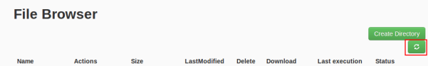
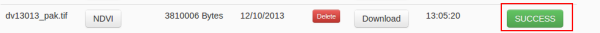

.. module:: cippak.admin.ndvi
   :synopsis: Learn about how to publish NDVI images.

.. _cippak.admin.ndvi:

.. raw:: latex

  \newpage % hard pagebreak at exactly this position   

NDVI Browser
============

This module is designed to learn how to deploy new NDVI images on the server. 

To access to this module you have to press the button on the navigation bar:

.. figure::  resources/nav_link.png	
   :align:   center

   NDVI browser module link.

This operation publish a new Geotiff image for a date interval on the NDVI layer.

File format
-----------

The name of the Geotiff file must have this format: `dvYYMMD_*.tif` with:

* **YY**: Year of the image: two last digits of the year. *e.g.1998 becomes 98; 2000 becomes 00*.
* **MM**: Month of the image: between 01 (January) and 12 (December)
* **D**: Dekad of the image: 1, 2 or 3

Execution flow
--------------

The execution flow for this operation is:

1. **Upload the new NDVI**: Select the Geotiff file to upload.

2. **Execute the ingestion**: Press on *NDVI* button on the uploaded file.

.. figure::  resources/upload.png	
   :align:   center

   Upload button.

3. **Update the file browser status**: If you want, you can see the ingestion status, 

.. figure::  resources/execution_st.png	
   :align:   center

   Get status after execution.

.. note:: If the file is too big, you will not be able to resume the status of the ingestion flow until the ingestion is finished. In this case, you will have to update the file browser status and wait for a '*SUCCESS*' or '*FAIL*' message about the ingested file.

   Update button.

4. **See the log**: Click on '*SUCCESS*' or '*FAIL*' message on the file 

   SUCCESS button.
   
.. raw:: latex

  \newpage % hard pagebreak at exactly this position   

and on '*Get status*' button on the next page. 

.. figure::  resources/get_status.png	
   :align:   center

   Get status button.

If the ingestion status is SUCCESS, 

.. figure::  resources/status.png	
   :align:   center

   Status of the execution.

you can view the new granule on the different NDVI selectors:

* `NDVI statistics <../stats/index.html>`_
* `NDVI tool <../../using/ndvi_tool/index.html#select-dekad>`_ (see user manual).