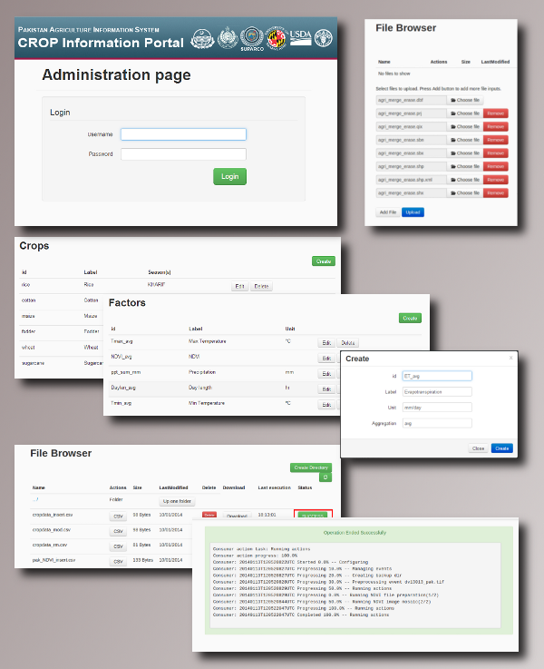

.. module:: cippak.overview
   :synopsis: Crop Information Portal overview.

.. _cippak.overview:

Overview
--------

**Crop Information Portal** is a web portal with reliable data and information on historical
and current crop data anda agro-metereological condition in Pakistan. It allows users to 
extract statistics and detect conditions affecting production of major Rabi and Kharif crops.
 
This document is an extension for the system administrators to explain how to use the **Crop Information Portal's admin interface**. If you need want to learn something about the user interface, please, use the ``User Manual`` instead this document.

   The administration interface.