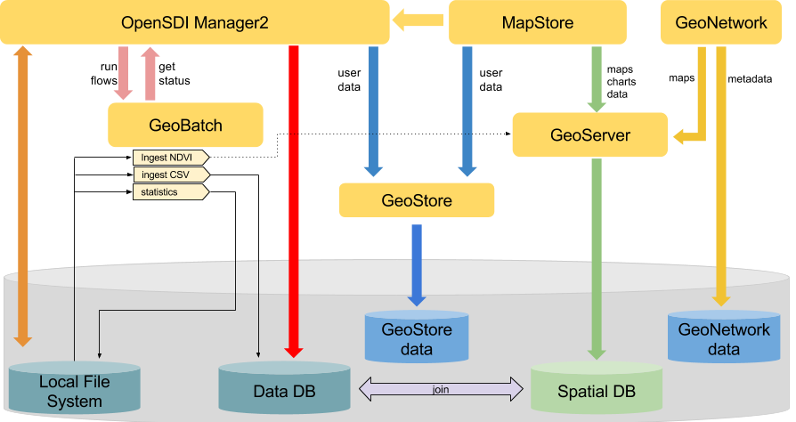

.. module:: cippak.admin.arch
   :synopsis: Learn about Crop Information Portal Components.

.. _cippak.admin.arch:

Components 
==========

The following are the components of the architecture of the Crop Information Portal. 
   
* **MapStore**: The main frontend to generate charts, maps and reports inferring Agrometereological data. Interacts with GeoServer to allow this kind of processing.
* **Administration Interface**: The administrator frontend to update published data and generate statistics from raster images interacting with GeoBatch. Provides also a Graphical User interface to manage users.
* **GeoStore**: a non-sql REST access database used for user related data. Manages the user roles and the log of their operations.
* **GeoServer** is an open source software server written in Java that allows users to share and edit geospatial data. Designed for interoperability, it publishes data from any major spatial data source using open standards.
* **GeoBatch** is an Open Source Java enterprise application for the collection, processing and publication of geospatial data in real time.

General Architecture 
====================
   

			Architecture of Crop Information Portal.

            
The *administrator interface* interacts directly with the file system, with the database and with *GeoBatch*. Allows to upload and download files and launch some *GeoBatch* flows on them. Provides also a direct
interaction with the database to customize the agrometeorological factors and crops to show inside *MapStore*.

*GeoBatch* runs flows using files from the filesystem. Depending on the type of flow geobatch interacts with the other components (publish data in geoserver, update database, create csv files...).

*MapStore* uses the capabilities of *GeoServer* to show aggregated data and maps. The filtering and aggregation functionalities are implemented as parametric views on *GeoServer*. 
All the parametric views in *GeoServer* are optimized to aggregate and filter the data in the fastest way. MapStore requires the proper output format to geoserver in order to show tabular data, maps, charts or download CSV files.

*GeoStore* is used to manage user data that are not directly connected with the model.

There are other small web applications non present in the schema:

*  **highcharts-export**: An application that allows to rasterize charts in various formats (*pdf, svg, png, jpeg*).
*  **http_proxy** : A secure proxy that can allow *MapStore* to get maps from other qualified WMS sources.
*  **xmlJsonTranslate** : a container of services required by *MapStore* grouped in a separated application.

