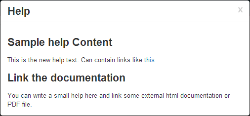

.. module:: cippak.admin.conf.admin.customization
   :synopsis: Learn about how to configure Crop Information Portal Components.

.. _cippak.admin.conf.admin.customization:

======================================
Administration Interface Customization
======================================

In this section we will learn how to simply customize the GUI of the Administation Interface.
Most of the JSP useful to customize the GUI of the Administration Interface are available at ::
 
    WEB-INF/jsp/common

* ``banner.jsp`` : the top banner
* ``footer.jsp`` : the footer
* ``help.jsp`` : the help window content
* ``navbar.jsp`` : the top navigation bar

Customizing the help
====================

Customize the help window content
---------------------------------

To add a simple content to the help window you can simply edit the ``help.jsp`` file changing the text at line ``10`` as follows::

    <!-- help.jsp -->
    <!-- Credits dialog -->
    

            

                    <button type="button" class="close" data-dismiss="modal"
                            aria-hidden="true">x</button>
                    <h3 id="myModalLabel">Help</h3>
            

            

                    <h3>Sample help Content</h3>
                    This is the new help text. Can contain links like <a href=" " target="_blank">this</a>
                    <h3>Link the documentation</h3>
                    You can write a small help here and link some external html documentation or PDF file.
            

    

    

You can refresh the Administration Interface page  (http://localhost:8083/admin/) and click on the help button to see the result.

			the new content of the help window.
            
            
change the help button
----------------------

If the help window is not wanted, you can simply link the help button with a link to an external resource.
To do this, simply modify the ``navbar.jsp`` line ``44`` as following::

     43         <ul class="nav pull-right">
     44            <li><a href="http://dwms.fao.org/~test/geo_portal_en.asp"  title="Help">Help</a></li>
     45            <li><a href="<c:url value="/j_spring_security_logout" />"><i class="icon-user"></i> ${username} <i class=" icon-off"></i> Logout</a></li>

And now the **Help** link in the navigation bar will point to the URL added in ``href`` attribute.

Add links to the Footer
=======================

You can add links to the footer bar simply adding content to the footer.jsp file inside the ``#footer`` div (line ``18``)::

    
    
<!-- Hidden div fro modal-backdrop -->

    <!-- Credits dialog -->
    

            

                    <button type="button" class="close" data-dismiss="modal"
                            aria-hidden="true">x</button>
                    <h3 id="myModalLabel">About this application</h3>
            

            

                    <iframe style='border: none; height: 360px; width: 360px' src='<c:url value="/about"/>' frameborder='0' border='0'>
                            <a target='_blank' href='<c:url value="/about.jsp"/>'>About</a>
                    </iframe>
            

    

    

            <button id="creditsOpener" class="icon-geoexplorer">Credits</button>
            <!-- this is the new link -->
            <a href="http://dwms.fao.org/~test/geo_portal_en.asp" class="pull-right" target="_blank">More information</a>

    

Save the file, refresh the page and see the new link to the bottom right of the window.

.. figure:: img/footer_link.png

			The new link in the footer.
            
.. note:: the link is aligned to the right because the class of the link is set as ``class="pull-right"``. To align to left, remove the class ``pull-right``

          