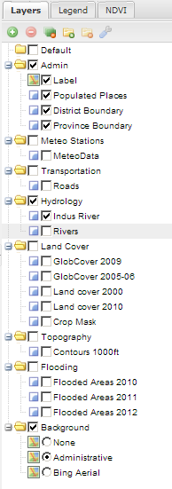
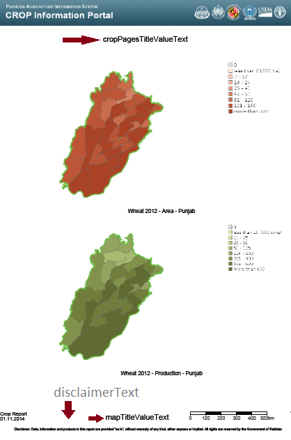
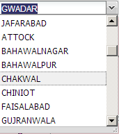

.. module:: cippak.admin.conf.mapstore.configuration
   :synopsis: This page explains how to configure the main MapStore Configuration file.

.. _cippak.admin.conf.mapstore.configuration:

======================
MapStore Configuration
======================

MapStore Configuration File
===========================
You can find the MapStore configuration file at::

    WEB-INF/app/static/config/mapStoreConfig.js
    

----------------------------
common configuration options
----------------------------

the first elements of the configuration file are common for every version of MapStore::

    {
       "geoStoreBase":"http://84.33.2.75/geostore/rest/",
       "proxy":"/http_proxy/proxy/?url=",
       "defaultLanguage": "en",
       "gsSources":{ 
            "nrl":{
                "ptype": "gxp_wmssource",
                "title": "NRL GeoServer",
                "projection":"EPSG:900913",
                "url": "http://84.33.2.75/geoserver/ows", 
                "layersCachedExtent": [
                    5009377.085000001,0.0, 1.0018754169999998E7,5009377.085000001
                ],
                "layerBaseParams": {
                   "format":"image/png8",
                   "TILED": true
                }
            },
            "mapquest": {
                "ptype": "gxp_mapquestsource"
            }, 
            "osm": { 
                "ptype": "gxp_osmsource"
            },
            "google": {
                "ptype": "gxp_googlesource" 
            },
            "bing": {
                "ptype": "gxp_bingsource" 
            }, 
            "ol": { 
                "ptype": "gxp_olsource" 
            }
        },
        "proj4jsDefs":{
            "EPSG:32642":"+proj=utm +zone=42 +ellps=WGS84 +datum=WGS84 +units=m +no_defs"

        },
        "map": {
            "projection": "EPSG:900913",
            "units": "m",
            "center": [7798771.2914706,3574215.5268897],
            "zoom":5,
            "maxExtent": [
                -20037508.34, -20037508.34, 20037508.34, 20037508.34
            ],

The configuration contains:

* ``geoStoreBase``: the url to geostore
* ``proxy``: the proxy url
* ``defaultLanguage``: the default sources
* ``proj4jsDefs``: the definition for ``EPSG:32642`` projection
* ``map``: base map configurations:

  * ``projection``: the projection of the map
  * ``units``: the unit of measure of the projection
  * ``center``: the initial center of the map
  * ``zoom``: the initial zoom of the map
  * ``maxExtent``: the max extent of the map

.. _mapstoreconfig.selectionlayers:

--------------------
Layers configuration
--------------------

The ``layers`` array contains the list of the arrays available on the map::

            "layers": [

The first 4 layers are not visible and not displayied in the Layer Switcher.
These hidden layers are needed to provide selection operations, and should not be removed::

                {
                    "id" :"Crop_Province",
                    "source": "nrl",
                    "title": "nrl:province_crop",
                    "name": "nrl:province_crop",
                    "displayInLayerSwitcher":false,
                    "visibility": false
                },	{
                    "source": "nrl",
                    "title": "nrl:district_crop",
                    "name": "nrl:district_crop",
                    "displayInLayerSwitcher":false,
                    "visibility": false
                },{
                    "source": "nrl",
                    "title": "nrl:province_boundary",
                    "name": "nrl:province_boundary",
                    "displayInLayerSwitcher":false,
                    "visibility": false
                },	{
                    "source": "nrl",
                    "title": "nrl:district_boundary",
                    "name": "nrl:district_boundary",
                    "displayInLayerSwitcher":false,
                    "visibility": false
                },

Than the visible background layers...::

                {
                    "source": "bing",
                    "title": "Bing Aerial",
                    "name": "Aerial",
                    "group": "background"
                },{
                    "source": "nrl",
                    "title": "Administrative",
                    "name": "nrl:g0gen_pak",
                    "format":"image/jpeg",
                    "group": "background",
                    "visibility": true,
                    "layersCachedExtent": [
                        -20037508.34,-20037508.34,
                        20037508.34,20037508.34
                    ]
                },{
                        "source": "ol",
                        "group": "background",
                        "fixed": true,
                        "type": "OpenLayers.Layer",
                        "visibility": false,
                        "args": [
                            "None", {"visibility": false}
                        ]
                },

...and layers inside the other groups::

                {
                    "source": "nrl",
                    "title": "Province Boundary",
                    "name": "nrl:province_boundary",
                    "group": "Admin",
                    "visibility": true
                },{
                    "source": "nrl",
                    "title": "Flooded Areas 2012",
                    "name": "nrl:flood_pak_2012",
                    "group": "Flooding",
                    "visibility": false
                },{
                    "source": "nrl",
                    "title": "Flooded Areas 2011",
                    "name": "nrl:flood_pak_2011",
                    "group": "Flooding",
                    "visibility": false
                },{
                    "source": "nrl",
                    "title": "Flooded Areas 2010",
                    "name": "nrl:flood_pak_2010",
                    "group": "Flooding",
                    "visibility": false
                },{
                    "source": "nrl",
                    "title": "Contours 1000ft",
                    "name": "nrl:ETOPO2v2c_1000ft_conts_ln_pak",
                    "group": "Topography",
                    "visibility": false
                },{
                    "source": "nrl",
                    "title": "Crop Mask",
                    "name": "nrl:crop_mask_pak_2012",
                    "group": "Land Cover",
                    "visibility": false
                },{
                    "source": "nrl",
                    "title": "Land cover 2010",
                    "name": "nrl:LULC2010_Pak",
                    "group": "Land Cover",
                    "visibility": false
                },{
                    "source": "nrl",
                    "title": "Land cover 2000",
                    "name": "nrl:LULC2000_Pak_wgs84",
                    "group": "Land Cover",
                    "visibility": false
                },{
                    "source": "nrl",
                    "title": "GlobCover 2005-06",
                    "name": "nrl:GLOBC2006_v2.2",
                    "group": "Land Cover",
                    "visibility": false
                },{
                    "source": "nrl",
                    "title": "GlobCover 2009",
                    "name": "nrl:GLOBC2009_v2.3",
                    "group": "Land Cover",
                    "visibility": false
                },{
                    "source": "nrl",
                    "title": "Rivers",
                    "name": "nrl:rivers_pak",
                    "group": "Hydrology",
                    "visibility": false
                },{
                    "source": "nrl",
                    "title": "Indus River",
                    "name": "nrl:indus_river_course",
                    "group": "Hydrology",
                    "visibility": true
                },{
                    "source": "nrl",
                    "title": "Roads",
                    "name": "nrl:roads_pak",
                    "group": "Transportation",
                    "visibility": false
                },{
                    "source": "nrl",
                    "title": "District Boundary",
                    "name": "nrl:district_boundary",
                    "group": "Admin",
                    "visibility": true
                },{
                    "source": "nrl",
                    "title": "MeteoData",
                    "name": "nrl:met_stations",
                    "group": "Meteo Stations",
                    "visibility": false
                },{
                    "source": "nrl",
                    "title": "Populated Places",
                    "buffer": "5",
                    "name": "nrl:POP_settlements_pak_main",
                    "group": "Admin",
                    "visibility": true
                },{
                    "source": "nrl",
                    "title": "Label",
                    "name": "nrl:adminisrative_labels",
                    "group": "Admin",
                    "visibility": true,
                    "layersCachedExtent": [
                        -20037508.34,-20037508.34,
                        20037508.34,20037508.34
                    ]
                }
                

			the layers added to the map.

(close the ``layers`` array and ``map`` object)::

            ]
        },

----------------------
Plugins configurations
----------------------

The ``customTools`` array contains the configuration of the addictional MapStore plugins developed for this application and the customizations for some of the
default ones::
 
        "customTools":[

Zoom plugin
^^^^^^^^^^^

The ``gxp_zoomtoextent`` plugin (|zoomplugin|) is customized to zoom exactly to the extent provided in the ``extent`` array 
The tooltip of the button is customized with the ``tooltip`` string::

            {
                "ptype": "gxp_zoomtoextent",
                "extent": [	6770799.251963,2705604.806669,8826743.330978,4442826.247111 ],
                "tooltip":"zoom to Pakistan Extent",
                "actionTarget": {"target": "paneltbar", "index": 2}
             },

Print plugin
^^^^^^^^^^^^
The **Print plugin** is not one of the default plugins for *MapStore*, so it have to be explicitly added:: 
             
            {
              "ptype":"gxp_print",
              "customParams":{
                 "outputFilename":"mapstore-print"
              },
              "printService":"http://84.33.2.75/geoserver/pdf/",
              "legendPanelId":"legendPanel",
              "ignoreLayers":["WFSSearch","Marker"],
              "appendLegendOptions":true,
              "actionTarget":{
                 "target":"paneltbar",
                 "index":4
              }
            },
            

NDVI plugin
^^^^^^^^^^^
The following plugins are the custom plugins' configurations for the Crop Information Portal.

The NDVI plugin is a plugin that allow to add a layer on the map choosing the year, month and dekad. The layer have to accept temporal requests::
        
        {
               "ptype":"gxp_ndvi",
                "dataUrl":"http://84.33.2.75/geoserver/ows",
                "layer":"ndvi:ndvi",
                "outputConfig":{
                      "title":"NDVI",
                      "id":"ndvi",
                      "region":"east",
                      "replace":"false"
               },
               "outputTarget":"east"
        },
        
*Configuration Options*: 

* ``dataURL``: the url of the WMS service
* ``layer``: the layer to add

NRL plugin
^^^^^^^^^^

the **NRL plugin** is simply a container for the panels on the left of the MapStore template::

        {
              "ptype":"gxp_nrl",
              "outputConfig":{
                 "id":"nrl",
                 "region":"east",
                 "startTab":"nrlCropData"
              },
              "outputTarget":"west"
           },
           

Crop Data plugin
^^^^^^^^^^^^^^^^

The **Crop Data** plugin implements the *Crop Data* tab functionalities::

           {
              "ptype":"nrl_crop_data",
              "layerStyle":{"strokeColor":"red","strokeWidth":1,"fillOpacity":0.2,"cursor":"pointer"}, 
              "dataUrl":"http://84.33.2.75/geoserver/ows",
              "rangesUrl": "http://84.33.2.75/geoserver/nrl/ows?service=WFS&version=1.0.0&request=GetFeature&typeName=nrl:cropdata_ranges&outputFormat=json",
              "highChartExportUrl" :"http://84.33.2.75/highcharts-export/",
              "layers":{
                "district":"nrl:district_crop",
                "province":"nrl:province_crop"
                },
              "outputConfig":{
                 "itemId":"nrlCropData"
                 
              },
              "outputTarget":"nrl"
           },

*Configuration Options*: 

* ``dataUrl``: the url of the WMS service
* ``layerStyle``: the style for the highlighting of the selected areas 
* ``rangesUrl``: the layer that expose the available crops and the yearly ranges of available data for each crop.
* ``highChartExportUrl``: the URL of the service that allows the chart exporting.
* ``areaFilter``: a filter to apply to the layers. Is used to filter the selectable areas.
* ``layers`` the layers for the selection tools (see :ref:`mapstoreconfig.selectionlayers` )
  * ``district`` the layer to query when the Area of interest type is *district*
  * ``province`` the layer to query when the Area of interest type is *province*

Argomet plugin
^^^^^^^^^^^^^^

The **Argomet** plugin implements the *Agromet Variables* tab functionalities::

           {
            "ptype":"nrl_agromet",
            "layerStyle":{"strokeColor":"green","strokeWidth":1,"fillOpacity":0.2,"cursor":"pointer"}, 
            "dataUrl":"http://84.33.2.75/geoserver/ows",
            "factorsurl":"http://84.33.2.75/geoserver/nrl/ows?service=WFS&version=1.0.0&request=GetFeature&typeName=nrl:agrometdescriptor&max&outputFormat=json",
            "highChartExportUrl" :"http://84.33.2.75/highcharts-export/",
            "areaFilter": "province NOT IN ('DISPUTED TERRITORY','DISPUTED AREA')",
            "titleText": "Agromet Variables",
              "outputConfig":{
                 "id":"Agromet"
              },
              "outputTarget":"nrl"
          },
          
*Configuration Options*: 

* ``dataUrl``: the url of the WMS service
* ``layerStyle``: the style for the highlighting of the selected areas 
* ``factorsurl``: the layer that expose the available factors and the yearly ranges of available data for each factor.
* ``areaFilter``: a filter to apply to the layers. Is used to filter the selectable areas.
* ``highChartExportUrl``: the URL of the service that allows the chart exporting.
* ``layers``: the layers for the selection tools (see :ref:`mapstoreconfig.selectionlayers` )
  * ``district``: the layer to query when the Area of interest type is *district*
  * ``province``: the layer to query when the Area of interest type is *province*

Crop Status
^^^^^^^^^^^ 

The **Crop Status** plugin implements the *Agromet Variables* tab functionalities::
 
          {
             "ptype":"nrl_crop_status",
             "factorsurl":"http://84.33.2.75/geoserver/nrl/ows?service=WFS&version=1.0.0&request=GetFeature&typeName=nrl:agrometdescriptor&max&outputFormat=json",
             "layerStyle":{"strokeColor":"blue","strokeWidth":1,"fillOpacity":0.2,"cursor":"pointer"},
             "rangesUrl": "http://84.33.2.75/geoserver/nrl/ows?service=WFS&version=1.0.0&request=GetFeature&typeName=nrl:cropdata_ranges&outputFormat=json",
             "dataUrl":"http://84.33.2.75/geoserver/ows",
             "highChartExportUrl" :"http://84.33.2.75/highcharts-export/",
              "outputConfig":{
                 "id":"nrlCropStatus"
              },
              "outputTarget":"nrl"
          },

*Configuration Options*:   
        
* ``dataUrl``: the url of the WMS service
* ``layerStyle``: the style for the highlighting of the selected areas 
* ``factorsurl``: the layer that expose the available factors and the yearly ranges of available data for each factor.
* ``rangesUrl``: the layer that expose the available crops and the yearly ranges of available data for each crop.
* ``highChartExportUrl``: the URL of the service that allows the chart exporting.
* ``layers`` the layers for the selection tools (see :ref:`mapstoreconfig.selectionlayers` )
  * ``district`` the layer to query when the Area of interest type is *district*
  * ``province`` the layer to query when the Area of interest type is *province*

Crop Report Plugin
^^^^^^^^^^^^^^^^^^

The **Crop Report Plugin** plugin implements the *Crop Report* tab functionalities::

          {
             "ptype":"nrl_report_crop_data",
             "factorsurl":"http://84.33.2.75/geoserver/nrl/ows?service=WFS&version=1.0.0&request=GetFeature&typeName=nrl:agrometdescriptor&max&outputFormat=json",
             "rangesUrl": "http://84.33.2.75/geoserver/nrl/ows?service=WFS&version=1.0.0&request=GetFeature&typeName=nrl:cropdata_ranges&outputFormat=json",
             "dataUrl":"http://84.33.2.75/geoserver/ows",
             "highChartExportUrl" :"http://84.33.2.75/highcharts-export/",
              "outputConfig":{
                 "id":"nrlReportCropData"
              },
              "layers":{
                "district":"nrl:district_crop",
                "province":"nrl:province_crop"
                },
                "targetLayerStyle":{
                    "strokeColor": "green",
                    "strokeWidth": 2,
                    "fillOpacity":0
                },
              "defaultAreaTypeMap": "district",
              "disclaimerText": "Disclaimer: Data, information and products in this report are provided \"as is\", without warranty of any kind, either express or implied. All rights are reserved by the Government of Pakistan",

              "outputTarget":"nrl"
           },

*Configuration Options*:
           
* ``dataUrl``: the url of the WMS service
* ``factorsurl``: the layer that expose the available factors and the yearly ranges of available data for each factor.
* ``rangesUrl``: the layer that expose the available crops and the yearly ranges of available data for each crop.
* ``highChartExportUrl``: the URL of the service that allows the chart exporting.
* ``layers``: the layers for the selection tools (see :ref:`mapstoreconfig.selectionlayers` )
    * ``district``: the layer to query when the Area of interest type is *district*
    * ``province``: the layer to query when the Area of interest type is *province*
* ``targetLayerStyle``: the style of the highlighted regions in the generated maps inside the pdf.
* ``defaultAreaTypeMap``: the default type of the map if not specified.
* ``disclaimerText``: the text to add to the disclaimer of the pdf.

The **Crop Report Plugin** uses also another plugin called *gxp_printreporthelper* to provide some customization options::

           {
              "ptype":"gxp_printreporthelper",
              "printService":"http://84.33.2.75/geoserver/pdf/",
              "dataUrl":"http://84.33.2.75/geoserver/ows",
              "defaultExtent": [6770799.251963,2705604.806669,8826743.330978,4442826.247111],
              "id":"printreporthelper",
              "hideAll":true,
              "mapTitleValueText": "Crop Report",
              "cropPagesTitleValueText": "Crop Maps and Charts",
              "meteorologicalPagesTitleValueText": "AgroMet Variables"
          },
          
*Configuration Options*:   
        
* ``printService``: the url of the print service
* ``dataUrl``: the url of the WFS service
* ``defaultExtent``: the default extent of the maps in the generated pdf.
* ``hideAll``: Don't show report window and hide layers if true.
* ``mapTitleValueText`` the title of the document to print.
* ``cropPagesTitleValueText`` the title of pages that contain crop data.
* ``meteorologicalPagesTitleValueText`` the title of pages that contain charts of argrometereological factors.
          
Login Plugin
^^^^^^^^^^^^

Adds the Login button to the toolbar.::

          {
                "actions": ["->"], 
                "actionTarget": "paneltbar"
          },{
                "ptype":"gxp_geostore_login",
                "loginService":"http://84.33.2.75/geostore/rest/users/user/details/",     
                "enableAdminGUILogin": true,
                "adminGUIUrl": "/admin", 
                "adminGUIHome": "/users",
                "adminLoginInvalidResponseValidator": "No AuthenticationProvider found",

                "isDummy":false,
                "actionTarget": "paneltbar"
          }

.. note:: ``"actions": ["->"]`` is a separator added to the toolbar to align the login button on the right

*Configuration Options*:

* ``loginService``: the service to call 
* ``enableAdminGUILogin``: if true, do the login on the Administration Page too. 
* ``adminGUIUrl``: URL of the admin application to link in the menu.
* ``adminGUIHome``: path where to go after the login to the Administratior GUI.
* ``adminLoginInvalidResponseValidator``: Error text if the service is not available.

			A Page from the PDF report.
            
(then the close the ``customTools`` array and the main configuration object)::

        ]
    }
References Tool
===============

The **References Tool** is the tool in the toolbar that allows to zoom to a particular region.

			referencs to areas to zoom.
            
The areas available for this tool are this file::

    WEB-INF/app/static/data/georeferences.js

This JavaScript file instantiate the ``georeferences_data`` variable.
The variable is an array of arrays with this form:: 

    ["AWARAN", //name of the area to display
    //bounding box in EPSG:4326
    "64.152076721191, 
    25.4553985595703,
    66.267013549804,
    27.500825881958"]
    
The data provided contain a join of districts and regions::

    var georeferences_data_districts = [["AWARAN" /*,...*/]/*...*/];
    var georeferences_data_provinces = [[/*...*/]/*,...*/];
    var georeferences_data =georeferences_data_provinces.concat(georeferences_data_districts);
   

