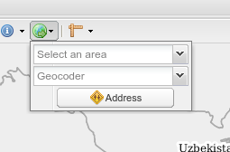

.. module:: cippak.admin.conf.mapstore.configuration
   :synopsis: This page explains how to configure the main MapStore Configuration file.

.. _cippak.admin.conf.mapstore.configuration:

======================
MapStore Configuration
======================

MapStore Configuration File
===========================
MapStore is the web application that provides the base view.

You can find the MapStore configuration file at::

    WEB-INF/app/static/config/mapStoreConfig.js

This is a :term:`JSON` file that implement the configuration of the viewer.

When you log-in into the application as an administrator, you will be able to open the Administration Page. This is configured in another file called ``managerConfig.js``::

    WEB-INF/app/static/config/managerConfig.js

The objects in theese to configurations are merged with the ``localConfig.js`` file that contain the options common to the map view and the administration page.::

    WEB-INF/app/static/config/common/localConfig.js

----------------------------
common configuration options
----------------------------

the first elements of the configuration file are common for every version of MapStore::

  {
      "geoStoreBase": "/geostore/rest/",
      "proxy": "/http_proxy/proxy/?url=",
      "defaultLanguage": "en",
      "tab": true,
      "gsSources": {
          "nrl": {
              "ptype": "gxp_wmssource",
              "title": "NRL GeoServer",
              "projection": "EPSG:900913",
              "url": "/geoserver/ows",
              "layersCachedExtent": [
                  5009377.085000001,
                  0.0,
                  10018754.169999998,
                  5009377.085000001
              ],
              "layerBaseParams": {
                  "format": "image/png8",
                  "TILED": true
              }
          },
          "mapquest": {
              "ptype": "gxp_mapquestsource"
          },
          "osm": {
              "ptype": "gxp_osmsource"
          },
          "google": {
              "ptype": "gxp_googlesource"
          },
          "ol": {
              "ptype": "gxp_olsource"
          }
      },
      "proj4jsDefs": {
          "EPSG:32642": "+proj=utm +zone=42 +ellps=WGS84 +datum=WGS84 +units=m +no_defs"
      },
      "map": {
          "projection": "EPSG:900913",
          "units": "m",
          "center": [
              7798771.2914706,
              3574215.5268897
          ],
          "zoom": 5,
          "maxExtent": [
              -20037508.34,
              -20037508.34,
              20037508.34,
              20037508.34
          ],

The configuration contains:

* ``geoStoreBase``: the url to geostore
* ``proxy``: the proxy url
* ``defaultLanguage``: the default sources
* ``proj4jsDefs``: the definition for ``EPSG:32642`` projection
* ``map``: base map configurations:

  * ``projection``: the projection of the map
  * ``units``: the unit of measure of the projection
  * ``center``: the initial center of the map
  * ``zoom``: the initial zoom of the map
  * ``maxExtent``: the max extent of the map

.. _mapstoreconfig.selectionlayers:

--------------------
Layers configuration
--------------------

The ``layers`` array contains the list of the arrays available on the map::

            "layers": [

The first 4 layers are not visible and not displayied in the Layer Switcher.
These hidden layers are needed to provide selection operations, and should not be removed::

      {
          "id": "Crop_Province",
          "source": "nrl",
          "title": "nrl:province_crop",
          "name": "nrl:province_crop",
          "displayInLayerSwitcher": false,
          "visibility": false
      },
      {
          "source": "nrl",
          "title": "nrl:district_crop",
          "name": "nrl:district_crop",
          "displayInLayerSwitcher": false,
          "visibility": false
      },
      {
          "source": "nrl",
          "title": "nrl:province_view",
          "name": "nrl:province_view",
          "displayInLayerSwitcher": false,
          "visibility": false
      },
      {
          "source": "nrl",
          "title": "nrl:district_view",
          "name": "nrl:district_view",
          "displayInLayerSwitcher": false,
          "visibility": false
      },
      {
          "source": "nrl",
          "title": "nrl:district_select",
          "name": "nrl:district_select",
          "displayInLayerSwitcher": false,
          "visibility": false
      },
      {
          "source": "nrl",
          "title": "nrl:province_select",
          "name": "nrl:province_select",
          "displayInLayerSwitcher": false,
          "visibility": false
      },
    Than the visible background layers...::

      {
            "source": "mapquest",
            "title": "MapQuest OpenStreetMap",
            "name": "osm",
            "group": "background",
            "visibility": true
        },
        {
            "source": "osm",
            "title": "Open Street Map",
            "name": "mapnik",
            "group": "background",
            "visibility": false
        },
        {
            "source": "bing",
            "title": "Bing Aerial",
            "name": "Aerial",
            "group": "background",
            "visibility": false
        },
        {
            "source": "bing",
            "title": "Bing Aerial With Labels",
            "name": "AerialWithLabels",
            "group": "background",
            "visibility": false
        },
        {
            "source": "google",
            "title": "Google Terrain",
            "name": "TERRAIN",
            "group": "background",
            "visibility": false
        },
        {
            "source": "google",
            "title": "Google Hybrid",
            "name": "HYBRID",
            "group": "background",
            "visibility": false
        },
        {
            "source": "google",
            "title": "Google Roadmap",
            "name": "ROADMAP",
            "group": "background",
            "visibility": false
        },
        {
            "source": "nrl",
            "title": "Administrative",
            "name": "nrl:g0gen_pak",
            "format": "image/jpeg",
            "group": "background",
            "visibility": true,
            "layersCachedExtent": [
                -20037508.34,
                -20037508.34,
                20037508.34,
                20037508.34
            ]
        },
        {
            "source": "ol",
            "group": "background",
            "fixed": true,
            "type": "OpenLayers.Layer",
            "visibility": false,
            "args": [
                "None",
                {
                    "visibility": false
                }
            ]
        },
...and layers inside the other groups::

      {
           "source": "nrl",
           "title": "Province Boundary",
           "name": "nrl:province_view",
           "group": "Admin",
           "visibility": true
       },
       {
           "source": "nrl",
           "title": "Flooded Areas 2012",
           "name": "nrl:flood_pak_2012",
           "group": "Flooding",
           "visibility": false
       },
       {
           "source": "nrl",
           "title": "Flooded Areas 2011",
           "name": "nrl:flood_pak_2011",
           "group": "Flooding",
           "visibility": false
       },
       {
           "source": "nrl",
           "title": "Flooded Areas 2010",
           "name": "nrl:flood_pak_2010",
           "group": "Flooding",
           "visibility": false
       },
       {
           "source": "nrl",
           "title": "Contours 1000ft",
           "name": "nrl:ETOPO2v2c_1000ft_conts_ln_pak",
           "group": "Topography",
           "visibility": false
       },
       {
           "source": "nrl",
           "title": "Crop Mask",
           "name": "nrl:crop_mask_pak_2012",
           "group": "Land Cover",
           "visibility": false
       },
       {
           "source": "nrl",
           "title": "Land cover 2010",
           "name": "nrl:LULC2010_Pak",
           "group": "Land Cover",
           "visibility": false
       },
       {
           "source": "nrl",
           "title": "Land cover 2000",
           "name": "nrl:LULC2000_Pak_wgs84",
           "group": "Land Cover",
           "visibility": false
       },
       {
           "source": "nrl",
           "title": "GlobCover 2005-06",
           "name": "nrl:GLOBC2006_v2.2",
           "group": "Land Cover",
           "visibility": false
       },
       {
           "source": "nrl",
           "title": "GlobCover 2009",
           "name": "nrl:GLOBC2009_v2.3",
           "group": "Land Cover",
           "visibility": false
       },
       {
           "source": "nrl",
           "title": "Rivers",
           "name": "nrl:rivers_pak",
           "group": "Hydrology",
           "visibility": false
       },
       {
           "source": "nrl",
           "title": "Indus River",
           "name": "nrl:indus_river_course",
           "group": "Hydrology",
           "visibility": true
       },
       {
           "source": "nrl",
           "title": "Roads",
           "name": "nrl:roads_pak",
           "group": "Transportation",
           "visibility": false
       },
       {
           "source": "nrl",
           "title": "District Boundary",
           "name": "nrl:district_view",
           "group": "Admin",
           "visibility": true
       },
       {
           "source": "nrl",
           "title": "MeteoData",
           "name": "nrl:met_stations",
           "group": "Meteo Stations",
           "visibility": false
       },
       {
           "source": "nrl",
           "title": "Populated Places",
           "buffer": "5",
           "name": "nrl:POP_settlements_pak_main",
           "group": "Admin",
           "visibility": true
       },
       {
           "source": "nrl",
           "title": "Label",
           "name": "nrl:adminisrative_labels",
           "group": "Admin",
           "visibility": true,
           "layersCachedExtent": [
               -20037508.34,
               -20037508.34,
               20037508.34,
               20037508.34
           ]
       }
.. figure:: img/layers.png

			the layers added to the map.

(close the ``layers`` array and ``map`` object)::

            ]
            },

----------------------
Plugins configurations
----------------------

The ``customTools`` array contains the configuration of the addictional MapStore plugins developed for this application and the customizations for some of the
default ones::

        "customTools":[

Portal Page
^^^^^^^^^^^
The "Static Page" plugin in MapStore allow to use a page to show in the tab. This plugin is used to provide the "Portal" tab of the application.::

        {
            "id": "gxp_portal_staticpage",
            "ptype": "gxp_staticpage",
            "url": "http://dwms.fao.org/~test/croportal/home_en.asp",
            "tabPosition": 0,
            "tabTitle": "Portal",
            "forceMultiple": true
        },

* **id** : the identifier
* **url** : url of the page to include
* **tabPosition**: the position of the tab (0 is the first position)
* **tabTitle**: the title of the tab
* **forceMultiple**: this is a required parameter for the MapStore plugins. By default the configurations in customTools are unique by type (gxp_staticpage) and a configuration ovveride the existing ones. forceMultiple allow to add more than one plugin of this type. In this case we need also a static page for GeoNetwork.

GeoNetwork
^^^^^^^^^^
Another static page has been provided for the integrated GeoNetwork tab. ::

  {
      "ptype": "gxp_staticpage",
      "url": "/geonetwork",
      "tabPosition": 10,
      "tabTitle": "Geonetwork",
      "forceMultiple": true
  },

As you see, you have the same parameters for the same plugin type.

Zoom plugin
^^^^^^^^^^^

.. |zoomplugin| image:: img/zoomplugin.png

The ``gxp_zoomtoextent`` plugin (|zoomplugin|) is customized to zoom exactly to the extent provided in the ``extent`` array.::

  {
       "ptype": "gxp_zoomtoextent",
       "extent": [
           6770799.251963,
           2705604.806669,
           8826743.330978,
           4442826.247111
       ],
       "actionTarget": {
           "target": "paneltbar",
           "index": 2
       }
   },

Print SnapShot
^^^^^^^^^^^^^^
This plugin is available for chome browsers, and allow to do a snapshot of the current view of the map.::

   {
         "ptype": "gxp_printsnapshot",
         "service": "/servicebox/",
         "customParams": {
             "outputFilename": "mapstore-print"
         },
         "actionTarget": {
             "target": "paneltbar",
             "index": 3
         },
         "disabledIn": ["internetExplorer", "Firefox"]
     },

Print plugin
^^^^^^^^^^^^
The **Print plugin** is not one of the default plugins for *MapStore*, so it have to be explicitly added::

            {
              "ptype":"gxp_print",
              "customParams":{
                 "outputFilename":"mapstore-print"
              },
              "printService":"http://84.33.2.75/geoserver/pdf/",
              "legendPanelId":"legendPanel",
              "ignoreLayers":["WFSSearch","Marker"],
              "appendLegendOptions":true,
              "actionTarget":{
                 "target":"paneltbar",
                 "index":4
              }
            },

GeoLocation Menu
^^^^^^^^^^^^^^^^
A menu with GeoLocation tools (References Tool, :term:`GeoCoder`, Address)::

        {
            "ptype": "gxp_geolocationmenu",
            "actionTarget": {
                "target": "paneltbar",
                "index": 16
            }
        },

      the geolocation menu

See also the "References Tool" section at the end of this chapter for details about how to configure it.

NDVI plugin
^^^^^^^^^^^
The following plugins are the custom plugins' configurations for the Crop Information Portal.

The NDVI plugin is a plugin that allow to add a layer on the map choosing the year, month and dekad. The layer have to accept temporal requests::

        {
               "ptype":"gxp_ndvi",
                "dataUrl":"http://84.33.2.75/geoserver/ows",
                "layer":"ndvi:ndvi",
                "outputConfig":{
                      "title":"NDVI",
                      "id":"ndvi",
                      "region":"east",
                      "replace":"false"
               },
               "outputTarget":"east"
        },

*Configuration Options*:

* ``dataURL``: the url of the WMS service
* ``layer``: the layer to add

NRL plugin
^^^^^^^^^^

the **NRL plugin** is simply a container for the panels on the left of the MapStore template::

        {
              "ptype":"gxp_nrl",
              "outputConfig":{
                 "id":"nrl",
                 "region":"east",
                 "startTab":"nrlCropData"
              },
              "outputTarget":"west"
           },

Crop Data plugin
^^^^^^^^^^^^^^^^

The **Crop Data** plugin implements the *Crop Data* tab functionalities::

  {
      "ptype": "nrl_crop_data",
      "id": "CropData",
      "mapToolPosition": 18,
      "layerStyle": {
          "strokeColor": "red",
          "strokeWidth": 1,
          "fillOpacity": 0.2,
          "cursor": "pointer"
      },
      "dataUrl": "/geoserver/ows",
      "rangesUrl": "/geoserver/nrl/ows?service=WFS&version=1.0.0&request=GetFeature&typeName=nrl:cropdata_ranges&outputFormat=json",
      "unitsUrl": "/geoserver/nrl/ows?service=WFS&version=1.0.0&request=GetFeature&typeName=nrl:measure_units_for_crop&outputFormat=json",
      "highChartExportUrl": "/highcharts-export/",
      "sourcesUrl": "/geoserver/nrl/ows?service=WFS&version=1.0.0&request=GetFeature&typeName=nrl:cropdata_sources&outputFormat=json",
      "layers": {
          "district": "nrl:district_crop",
          "province": "nrl:province_view"
      },
      "outputConfig": {
          "itemId": "nrlCropData"
      },
      "outputTarget": "nrl",
      "portalRef": "gxp_portal_staticpage",
      "helpPath": "/~test/croportal/hlp_cropdata_en.asp"
  },

*Configuration Options*:

* ``dataUrl``: the url of the WMS service
* ``layerStyle``: the style for the highlighting of the selected areas
* ``rangesUrl``: the layer that expose the available crops and the yearly ranges of available data for each crop.
* ``unitsUrl``: the layer that expose the available units of measure.
* ``sourcesUrl``: the layer that expose the available units of sources (a list of the ones on the database)
* ``highChartExportUrl``: the URL of the service that allows the chart exporting.
* ``areaFilter``: a filter to apply to the layers. Is used to filter the selectable areas.
* ``layers`` the layers for the selection tools (see :ref:`mapstoreconfig.selectionlayers` )
  * ``district`` the layer to query when the Area of interest type is *district*
  * ``province`` the layer to query when the Area of interest type is *province*
* ``portalRef``: the id of the plugin to use for help
* ``helpPath``: the path to the help for this tool (from the original )

Argomet plugin
^^^^^^^^^^^^^^

The **Argomet** plugin implements the *Agromet Variables* tab functionalities::

           {
            "ptype":"nrl_agromet",
            "layerStyle":{"strokeColor":"green","strokeWidth":1,"fillOpacity":0.2,"cursor":"pointer"},
            "dataUrl":"http://84.33.2.75/geoserver/ows",
            "factorsurl":"http://84.33.2.75/geoserver/nrl/ows?service=WFS&version=1.0.0&request=GetFeature&typeName=nrl:agrometdescriptor&max&outputFormat=json",
            "highChartExportUrl" :"http://84.33.2.75/highcharts-export/",
            "areaFilter": "province NOT IN ('DISPUTED TERRITORY','DISPUTED AREA')",
            "titleText": "Agromet Variables",
              "outputConfig":{
                 "id":"Agromet"
              },
              "outputTarget":"nrl"
          },

*Configuration Options*:

* ``dataUrl``: the url of the WMS service
* ``layerStyle``: the style for the highlighting of the selected areas
* ``factorsurl``: the layer that expose the available factors and the yearly ranges of available data for each factor.
* ``areaFilter``: a filter to apply to the layers. Is used to filter the selectable areas.
* ``highChartExportUrl``: the URL of the service that allows the chart exporting.
* ``layers``: the layers for the selection tools (see :ref:`mapstoreconfig.selectionlayers` )
  * ``district``: the layer to query when the Area of interest type is *district*
  * ``province``: the layer to query when the Area of interest type is *province*
* ``portalRef``: the id of the plugin to use for help
* ``helpPath``: the path to the help for this tool (from the original )

Fertilizers
^^^^^^^^^^^

The **Fertilizers** plugin implements the *Fertilizers* tab functionalities::

      {
          "ptype": "nrl_fertilizers",
          "layerStyle": {
              "strokeColor": "purple",
              "strokeWidth": 1,
              "fillOpacity": 0.2,
              "cursor": "pointer"
          },
          "typeNameData": "nrl:fertilizer_data",
          "dataUrl": "/geoserver/ows",
          "factorsurl": "/geoserver/nrl/ows?service=WFS&version=1.0.0&request=GetFeature&typeName=nrl:agrometdescriptor&max&outputFormat=json",
          "metadataUrl": "/geoserver/nrl/ows?service=WFS&version=1.0.0&request=GetFeature&typeName=nrl:fertilizers_metadata&outputFormat=json",
          "highChartExportUrl": "/highcharts-export/",
          "titleText": "Fertilizers",
          "outputConfig": {
              "id": "Fertilizers"
          },
          "outputTarget": "nrl",
          "layers": {
              "district": "nrl:district_crop",
              "province": "nrl:province_view"
          },
          "portalRef": "gxp_portal_staticpage",
          "helpPath": "/~test/croportal/hlp_fertilizer_en.asp"
      },

*Configuration Options*:

* ``dataUrl``: the url of the WMS service
* ``layerStyle``: the style for the highlighting of the selected areas
* ``metadataUrl``: the layer that exposes the metadata for the fertilizer plugin (fertilizers and data limits).
* ``areaFilter``: a filter to apply to the layers. Is used to filter the selectable areas.
* ``highChartExportUrl``: the URL of the service that allows the chart exporting.
* ``layers``: the layers for the selection tools (see :ref:`mapstoreconfig.selectionlayers` )
  * ``district``: the layer to query when the Area of interest type is *district*
  * ``province``: the layer to query when the Area of interest type is *province*
* ``portalRef``: the id of the plugin to use for help
* ``helpPath``: the path to the help for this tool (from the original )

Irrigation
^^^^^^^^^^
The **Irrigation** plugin implements the *Irrigation* tab functionalities::

      {
            "ptype": "nrl_irrigation",
            "layerStyle": {
                "strokeColor": "aqua",
                "strokeWidth": 1,
                "fillOpacity": 0.3,
                "cursor": "pointer"
            },
            "dataUrl": "/geoserver/ows",
            "factorsurl": "/geoserver/nrl/ows?service=WFS&version=1.0.0&request=GetFeature&typeName=nrl:measure_units_for_crop&outputFormat=json",
            "defaultUOMFlow":"1",
            "defaultUOMSupply":"1",
            "metadataFlowUrl": "/geoserver/nrl/ows?service=WFS&version=1.0.0&request=GetFeature&typeName=nrl:irrigation_metadata_flow&outputFormat=json",
            "metadataSupplyUrl": "/geoserver/nrl/ows?service=WFS&version=1.0.0&request=GetFeature&typeName=nrl:irrigation_metadata_supply&outputFormat=json",
            "highChartExportUrl": "/highcharts-export/",
            "titleText": "Water Resources",
            "outputConfig": {
                "id": "Irrigation"
            },
            "outputTarget": "nrl",
            "layers": {
                "province": "nrl:province_view",
                "district": "nrl:district_crop"
            },
            "areaFilter": "province NOT IN ('DISPUTED TERRITORY','DISPUTED AREA')",
            "portalRef": "gxp_portal_staticpage",
            "helpPath": "/~test/croportal/hlp_water_en.asp"
        },

*Configuration Options*:

* ``dataUrl``: the url of the WMS service
* ``layerStyle``: the style for the highlighting of the selected areas
* ``factorsurl``: the layer that expose the units of measure for the waterflow data.
* ``defaultUOMFlow``: The value of the factor of the default unit of measure for waterflow data.
* ``defaultUOMSupply``: The value of the factor of the default unit of measure for water supply data.
* ``metadataFlowUrl``: the layer that expose the metadata for the waterflow data (rivers and data limits).
* ``metadataSupplyUrl``: the layer that expose the metadata for the water supply data (data limits).
* ``areaFilter``: a filter to apply to the layers. Is used to filter the selectable areas.
* ``highChartExportUrl``: the URL of the service that allows the chart exporting.
* ``layers``: the layers for the selection tools (see :ref:`mapstoreconfig.selectionlayers` )
  * ``district``: the layer to query when the Area of interest type is *district*
  * ``province``: the layer to query when the Area of interest type is *province*
* ``portalRef``: the id of the plugin to use for help
* ``helpPath``: the path to the help for this tool (from the original )

Market Prices
^^^^^^^^^^^^^

The **Market Prices** plugin implements the *Market Prices* tab functionalities::

          {
              "ptype": "nrl_market_prices",
              "layerStyle": {
                  "strokeColor": "orange",
                  "strokeWidth": 1,
                  "fillOpacity": 0.3,
                  "cursor": "pointer"
              },
              "currencies": [
                  [
                      "usd",
                      "US Dollars"
                  ],
                  [
                      "pkr",
                      "PK Rupees"
                  ]
              ],
              "defaultCurrency": "pkr",
              "defaultDenominator": "0.4",
              "dataUrl": "/geoserver/ows",
              "factorsurl": "/geoserver/nrl/ows?service=WFS&version=1.0.0&request=GetFeature&typeName=nrl:measure_units_for_crop&outputFormat=json",
              "metadataUrl": "/geoserver/nrl/ows?service=WFS&version=1.0.0&request=GetFeature&typeName=nrl:marketprices_metadata&outputFormat=json",
              "highChartExportUrl": "/highcharts-export/",
              "titleText": "Market Prices",
              "outputConfig": {
                  "id": "Market Prices"
              },
              "outputTarget": "nrl",
              "layers": {
                  "province": "nrl:province_view",
                  "district": "nrl:district_crop"
              },
              "areaFilter": "province NOT IN ('DISPUTED TERRITORY','DISPUTED AREA')",
              "portalRef": "gxp_portal_staticpage",
              "helpPath": "/~test/croportal/hlp_market_en.asp"
          },
*Configuration Options*:

* ``dataUrl``: the url of the WMS service
* ``layerStyle``: the style for the highlighting of the selected areas
* ``currencies``: The currencies available.
* ``defaultCurrency``: dafault currency
* ``defaultDenominator``: the default denominator
* ``factorsurl``: the layer that expose the units of measure for the currency data.
* ``metadataUrl``: the layer that expose the metadata for the market prices data (commodities and data limits).
* ``areaFilter``: a filter to apply to the layers. Is used to filter the selectable areas.
* ``highChartExportUrl``: the URL of the service that allows the chart exporting.
* ``layers``: the layers for the selection tools (see :ref:`mapstoreconfig.selectionlayers` )
  * ``district``: the layer to query when the Area of interest type is *district*
  * ``province``: the layer to query when the Area of interest type is *province*
* ``portalRef``: the id of the plugin to use for help
* ``helpPath``: the path to the help for this tool (from the original )

Crop Status
^^^^^^^^^^^

The **Crop Status** plugin implements the *Agromet Variables* tab functionalities::

          {
            "ptype": "nrl_crop_status",
            "layerStyle": {
              "strokeColor": "blue",
              "strokeWidth": 1,
              "fillOpacity": 0.2,
              "cursor": "pointer"
            },
            "factorsurl": "/geoserver/nrl/ows?service=WFS&version=1.0.0&request=GetFeature&typeName=nrl:agrometdescriptor&max&outputFormat=json",
            "rangesUrl": "/geoserver/nrl/ows?service=WFS&version=1.0.0&request=GetFeature&typeName=nrl:cropdata_ranges&outputFormat=json",
            "dataUrl": "/geoserver/ows",
            "highChartExportUrl": "/highcharts-export/",
            "outputConfig": {
              "id": "nrlCropStatus"
            },
            "outputTarget": "nrl",
            "portalRef": "gxp_portal_staticpage",
            "helpPath": "/~test/croportal/hlp_status_en.asp"
        },

*Configuration Options*:

* ``dataUrl``: the url of the WMS service
* ``layerStyle``: the style for the highlighting of the selected areas
* ``factorsurl``: the layer that expose the available factors and the yearly ranges of available data for each factor.
* ``rangesUrl``: the layer that expose the available crops and the yearly ranges of available data for each crop.
* ``highChartExportUrl``: the URL of the service that allows the chart exporting.
* ``layers`` the layers for the selection tools (see :ref:`mapstoreconfig.selectionlayers` )
  * ``district`` the layer to query when the Area of interest type is *district*
  * ``province`` the layer to query when the Area of interest type is *province*

Crop Report Plugin
^^^^^^^^^^^^^^^^^^

The **Crop Report Plugin** plugin implements the *Crop Report* tab functionalities::

    {
        "ptype": "nrl_report_crop_data",
        "cropPluginRef": "CropData",
        "factorsurl": "/geoserver/nrl/ows?service=WFS&version=1.0.0&request=GetFeature&typeName=nrl:agrometdescriptor&max&outputFormat=json",
        "rangesUrl": "/geoserver/nrl/ows?service=WFS&version=1.0.0&request=GetFeature&typeName=nrl:cropdata_ranges&outputFormat=json",
        "unitsUrl": "/geoserver/nrl/ows?service=WFS&version=1.0.0&request=GetFeature&typeName=nrl:measure_units_for_crop&outputFormat=json",
        "dataUrl": "/geoserver/ows",
        "highChartExportUrl": "/highcharts-export/",
        "outputConfig": {
            "id": "nrlReportCropData"
        },
        "layers": {
            "district": "nrl:district_crop",
            "province": "nrl:province_view"
        },
        "targetLayerStyle": {
            "strokeColor": "green",
            "strokeWidth": 2,
            "fillOpacity": 0
        },
        "defaultAreaTypeMap": "district",
        "disclaimerText": "Disclaimer: Data, information and products in this report are provided \"as is\", without warranty of any kind, either express or implied. All rights are reserved by the Government of Pakistan",
        "areaFilter": "province NOT IN ('GILGIT BALTISTAN','AJK','DISPUTED TERRITORY','DISPUTED AREA')",
        "outputTarget": "nrl",
        "portalRef": "gxp_portal_staticpage",
        "helpPath": "/~test/croportal/hlp_report_en.asp"
      },

.. figure:: img/report.png

			A Page from the PDF report.
*Configuration Options*:

* ``dataUrl``: the url of the WMS service
* ``factorsurl``: the layer that expose the available factors and the yearly ranges of available data for each factor.
* ``rangesUrl``: the layer that expose the available crops and the yearly ranges of available data for each crop.
* ``highChartExportUrl``: the URL of the service that allows the chart exporting.
* ``layers``: the layers for the selection tools (see :ref:`mapstoreconfig.selectionlayers` )
    * ``district``: the layer to query when the Area of interest type is *district*
    * ``province``: the layer to query when the Area of interest type is *province*
* ``targetLayerStyle``: the style of the highlighted regions in the generated maps inside the pdf.
* ``defaultAreaTypeMap``: the default type of the map if not specified.
* ``disclaimerText``: the text to add to the disclaimer of the pdf.

The **Crop Report Plugin** uses also another plugin called *gxp_printreporthelper* to provide some customization options::

      {
          "ptype": "gxp_printreporthelper",
          "printService": "/geoserver/pdf/",
          "dataUrl": "/geoserver/ows",
          "defaultExtent": [
              6770799.251963,
              2705604.806669,
              8826743.330978,
              4442826.247111
          ],
          "id": "printreporthelper",
          "hideAll": true,
          "mapTitleValueText": "Crop Report",
          "cropPagesTitleValueText": "Crop Maps and Charts",
          "meteorologicalPagesTitleValueText": "AgroMet Variables"
      },

*Configuration Options*:

* ``printService``: the url of the print service
* ``dataUrl``: the url of the WFS service
* ``defaultExtent``: the default extent of the maps in the generated pdf.
* ``hideAll``: Don't show report window and hide layers if true.
* ``mapTitleValueText`` the title of the document to print.
* ``cropPagesTitleValueText`` the title of pages that contain crop data.
* ``meteorologicalPagesTitleValueText`` the title of pages that contain charts of argrometereological factors.

Login Plugin
^^^^^^^^^^^^

Adds the Login button to the toolbar.::

    {
        "actions": [
            "->"
        ],
        "actionTarget": "paneltbar"
    },
    {
        "ptype": "gxp_geostore_login",
        "loginService": "/geostore/rest/users/user/details/",
        "enableAdminGUILogin": true,
        "renderAdminToTab": true,
        "autoLogin": true,
        "adminGUIUrl": "/manager",
        "adminGUIHome": "",
        "adminLoginInvalidResponseValidator": "No AuthenticationProvider found",
        "isDummy": false,
        "actionTarget": "paneltbar"
    },

.. note:: ``"actions": ["->"]`` is a separator added to the toolbar to align the login button on the right

*Configuration Options*:

* ``loginService``: the service to call
* ``enableAdminGUILogin``: if true, do the login on the Administration Page too.
* ``adminGUIUrl``: URL of the admin application to link in the menu.
* ``adminGUIHome``: path where to go after the login to the Administratior GUI.
* ``adminLoginInvalidResponseValidator``: Error text if the service is not available.

Disclaimer
^^^^^^^^^^

The disclaimer is a custom plugin that implement the button in the bottom bar with the link to the disclaimer.::

    {
          "ptype":"gxp_disclaimer",
          "id": "disclaimer",
          "actionTarget": "appTabs.bbar",
          "text":"Disclaimer",
          "tooltip":"Open the Disclaimer",
          "index": 26,
          "showOnStartup":false,
          "iconCls":"icon-about",
          "portalRef": "gxp_portal_staticpage",
          "disclaimerPath": "/~test/croportal/doc_cip_disclaimer_en.asp"
      }

*Configuration Options*:

* ``text``: the text of the disclaimer
* ``tooltip``: The tooltip of the disclaimer
* ``iconCls``: The icon of the button (css class)
* ``portalRef``: the id of the plugin to use for help
* ``disclaimerPath``: Error text if the service is not available.

.. figure:: img/disclaimer.png

			The disclaimer.

(then the close the ``customTools`` array and the main configuration object)::

        ]
        }

References Tool
===============

The **References Tool** is the tool in the geolocation menu that allows to zoom to a particular region.

.. figure:: img/georeferences.png

			referencs to areas to zoom.

The areas available for this tool are this file::

    WEB-INF/app/static/data/georeferences.js

This JavaScript file instantiate the ``georeferences_data`` variable.
The variable is an array of arrays with this form::

    ["AWARAN", //name of the area to display
    //bounding box in EPSG:4326
    "64.152076721191,
    25.4553985595703,
    66.267013549804,
    27.500825881958"]

The data provided contain a join of districts and regions::

    var georeferences_data_districts = [["AWARAN" /*,...*/]/*...*/];
    var georeferences_data_provinces = [[/*...*/]/*,...*/];
    var georeferences_data =georeferences_data_provinces.concat(georeferences_data_districts);
