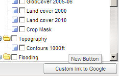

.. module:: cippak.admin.conf.mapstore.customization
   :synopsis: Learn about how to configure Crop Information Portal Components.

.. _cippak.admin.conf.mapstore.customization:

MapStore Customization
======================

In this section we will learn how to simply customize the GUI of MapStore.

------------------------
Customizing the Template
------------------------
The main html page that contains the application is available at::

    app/static/templates/composer.html
    
Editing this file you can change the banner, for example, or add buttons to the bottom bar.

Change the Banner
-----------------
 
At line  ``257`` you can find the html of the top banner that can be customized here::
    
    html:  [
            '
',
            '',
            '',
             //...
            ]
        

Adding Buttons and Links to the button bar
------------------------------------------

At line ``285`` you can find the creation of the main Viewport::

            var appViewport = new Ext.Viewport({
                id: 'appVieport',
                layout:'fit',
                border:false,
                items: [{
					id:'appWrapper',
                    region : 'center',
                    layout : 'border',
                    border : false,
                    header : false,                    
                    items : [headerConfig,appTabs],                            
                    bbar : [
                      aboutButton, '->'//, languageSelector
                      
                    ]
                }]
            });
            
Before the line ``285`` add this code to create a new button::

        var link = new Ext.Button({
                tooltip: 'New Button',
                text: "Custom link to Google",
                width : 150,
                handler: function(btn){
                    window.open('http://google.com/', '_blank');
                }
            });  
            
and add the ``link`` button to the ``bbar`` array of the ``appViewport``::

            var appViewport = new Ext.Viewport({
                id: 'appVieport',
                layout:'fit',
                border:false,
                items: [{
					id:'appWrapper',
                    region : 'center',
                    layout : 'border',
                    border : false,
                    header : false,                    
                    items : [headerConfig,appTabs],                            
                    bbar : [
                      aboutButton, '->'//, languageSelector
                      ,link
                      
                    ]
                }]
            });
            
An then reload the `MapStore page  <http://localhost:8083/MapStore/>`_.
You can see the new button at the bottom right of the page.

			The new button.
