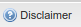

.. module:: cippak.admin.conf.mapstore.customization
   :synopsis: Learn about how to configure Crop Information Portal Components.

.. _cippak.admin.conf.mapstore.customization:

MapStore Customization
======================

In this section we will learn how to simply customize the GUI of MapStore.

------------------------
Customizing the Template
------------------------
The main file that contains the application configuration is available at::

    app/static/config/mapStoreConfig.js

Editing this file you can change the banner, for example, or add buttons to the bottom bar.

Change the Banner
-----------------

The default banner is confiured in the file ::

    app/static/config/common/localConfig.js

That is the base configuration common to all the services. You can override the header adding this
to your mapStoreConfig ::

      [...]
      "tab": true
      "header": {
          "container": {
              "border": false,
              "header": false,
              "collapsible": true,
              "collapsed": false,
              "collapseMode": "mini",
              "hideCollapseTool": true,
              "split": true,
              "animCollapse": false,
              "minHeight": 90,
              "maxHeight": 90,
              "height": 109,
              "id": "header"
          },
          "html": [ "
",
                          "",
                          "",
                      "
",
                      "<map name=\"IM_left-banner\">",
                          "<area shape=\"rect\" coords=\"19,19,393,44\" href=\"http://dwms.fao.org/~test/home_en.asp\"  target=\"_blank\" alt=\"Pakistan Agriculture Information System\" title=\"Pakistan Agriculture Information System\"    />",
                      "</map>",
                      "<map name=\"IM_right-banner\">",
                          "<area shape=\"rect\" coords=\"330,23,382,83\" href=\"http://www.fao.org\"  target=\"_blank\" alt=\"Food and Agriculture Organization of the United Nations\" title=\"Food and Agriculture Organization of the United Nations\"    />",
                          "<area shape=\"rect\" coords=\"274,23,325,83\" href=\"http://www.usda.gov/wps/portal/usda/usdahome\"  target=\"_blank\" alt=\"U.S. Department of Agriculture\" title=\"U.S. Department of Agriculture\"    />",
                          "<area shape=\"rect\" coords=\"205,23,268,83\" href=\"http://www.umd.edu/\"  target=\"_blank\" alt=\"University of Maryland\" title=\"University of Maryland\"    />",
                          "<area shape=\"rect\" coords=\"142,23,204,83\" href=\"http://www.suparco.gov.pk/\"  target=\"_blank\" alt=\"SUPARCO - Pakistan Space and Upper Atmosphere Research Commission\" title=\"SUPARCO - Pakistan Space and Upper Atmosphere Research Commission\"    />",
                          "<area shape=\"rect\" coords=\"85,23,141,83\" href=\"http://www.sindhagri.gov.pk/\"  target=\"_blank\" alt=\"SINDH Province\" title=\"SINDH Province\"    />",
                      "</map>"]
      },

See ``punjab.js`` and ``sindh.js`` examples in the ``app/static/config/`` directory.
You can test these configurations using the ``config`` parameter in the URL.

E.g. :
  http://localhost:8888/MapStore/?config=sindh

Adding Buttons and Links to the button bar
------------------------------------------

``mapStoreConfig.js`` file contain the ``customTools`` array that allows to add plugins to the application::

You can add this entry to the :term:`json` file to  add a button that open a window::

        {
         "ptype":"gxp_help",
         "actionTarget": "appTabs.bbar",
         "text":"Disclaimer",
         "tooltip":"About This Exemple",
         "title":"Crop Source Disclaimer",
         "index": 26,
         "showOnStartup":false,
         "iconCls":"icon-about",
         "description": "<h1>SUPARCO Source</h1> 
The Pakistan Space and Upper Atmosphere Research Commission (SUPARCO) publishes estimates   of major crops in Pakistan at provincial scale. They are based on Area Framing and Satellite Image   Classification methodologies. In order to allow SUPARCO estimates to be managed in the Crop   Information Portal, provincial data have been disaggregated by District through the application of a   model which does not reflect the actual distribution or area, production and yield. Thus, users of the   Crop Portal performing comparisons of SUPARCO estimates with official data must consider that   the results are accurate for Province comparisons only. Comparison of Districts are inaccurate   and must not be used to make assumptions.
",
         "windowOptions":{
             "constrain":true
         }
        }

An then reload the `MapStore page  <http://localhost:8888/MapStore/>`_.
You can see the new button at the bottom right of the page.

			The new button.

An then reload the `MapStore page  <http://localhost:8888/MapStore/>`_.
