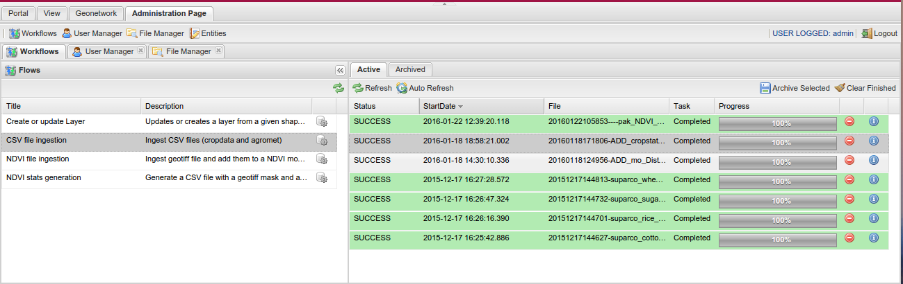

.. module:: cippak.admin.conf.mapstore.manager
   :synopsis: This page explains how to configure the main MapStore Manager file.

.. _cippak.admin.conf.mapstore.configuration:

======================
Administration Page
======================
The "Administration Page" interacts with various server side services to allow an
administrator to manage the Crop Information Portal.

			The Administration Page

Just for information it interacts with:

* Geobatch (Flows)
* GeoStore (User Management, Flow archiviation)
* OpenSDI Manager 2 (File Manager, configuration of Crops, Agromet Variables, Units of measure)

Configuration File
==================

When you log-in into the application as an administrator, you will be able to open the Administration Page.
This is configured in a :term:`JSON` file called ``managerConfig.js``::

    WEB-INF/app/static/config/managerConfig.js

The objects in theese to configurations are merged with the ``localConfig.js`` file that contain the options common to the map view and the administration page.::

    WEB-INF/app/static/config/common/localConfig.js

----------------------------
common configuration options
----------------------------
the ``mapStoreConfig.js`` contains some base configurations at the beginning.
They are not not important for the crop information portal configuration ::

    {
        "composerUrl": "",
        "socialUrl": "",
        "start": 0,
        "limit": 20,
        "msmTimeout": 30000,
        "header": {},
        "twitter": {
            "via": "geosolutions_it",
            "hashtags": ""
        },
        "mediaContent": "./externals/mapmanager/theme/media/",
        "ASSET": {
            "delete_icon": "./externals/mapmanager/theme/img/user_delete.png",
            "edit_icon": "./externals/mapmanager/theme/img/user_edit.png"
        },
        "locales": [
            [
                "en",
                "English"
            ],
            [
                "it",
                "Italiano"
            ],
            [
                "fr",
                "Français"
            ],
            [
                "de",
                "Deutsch"
            ],
            [
                "es",
                "Español"
            ]
        ],

After theese base configurations there are 3 main sections:
  * **tools**: the tools when a user is not logged in
  * **adminTools**: the configurations of the tools when an administrator is logged in
  * **loggedTools** the tools when a non administrator user is logged in

For the crop information portal only the administrator can access to the administration page, so the only important section
is the **adminTools**

Workflows
^^^^^^^^^

This is the tool that communicate with GeoBatch to ingest CSV files, shape files, NDVI images and generate statistics. ::

        {
            "ptype": "mxp_geobatch_flows",
            "autoOpen": true,
            "closable": false,
            "geoBatchRestURL": "/geobatch/rest/",
            "skipFlowsNotInRunConfigs": true,
            "runConfigs": {
                [...]
            },
            "actionTarget": {
                "target": "north.tbar",
                "index": 1
            }
        },

* **autoOpen**: open on startup
* **closable**: the tool (the tab) can not be closed
* **geoBatchRestURL**: URL of the GeoBatch ReST interface
* **skipFlowsNotInRunConfigs**: if true, the tool shows only the GeoBatch flows present in the **runConfigs** configuration
* **runConfigs**: contain the configurations of the GUI for each flow (i.e. CSV file ingestion)
* **actionTarget**: where to place the button of the tool (not important)

**runConfigs** contain the configurations for the GUI to run the GeoBatch Flows.

**CSV file ingestion** starts the ingestion of the CSV files for updates ::

   "csvingestion": {
       "xtype": "geobatch_csv_ingestion_run_form",
       "baseDir": "/opt/admin_dir",
       "fileBrowserUrl": "mvc/fileManager/extJSbrowser",
       "fileRegex": "\\.csv$",
       "path": "/",
       "ingestionSources": [
           ["Cropdata", "Crop Data"],
           ["Cropstatus", "Crop Status"],
           ["Agromet", "Agromet Variables"],
           ["Fertilizer", "Fertilizer"],
           ["Market Prices", "Market Prices"],
           ["Water Resources", "Water Resources"]
       ],
       "propertiesLists": {
           "marketPrices": ["denominator", "exchangeRate"],
           "cropData": ["src"]
       },
       "factorUrl": "/geoserver/nrl/ows?service=WFS&version=1.0.0&request=GetFeature&typeName=nrl:measure_units_for_crop&outputFormat=json",
       "sourcesUrl": "/geoserver/nrl/ows?service=WFS&version=1.0.0&request=GetFeature&typeName=nrl:cropdata_sources&outputFormat=json",
       "mediaContent": "./externals/mapmanager/theme/media/"
   },

**NDVI file ingestion** start the ingestion of the new NDVI image::

   "ndviingestion": {
       "xtype": "geobatch_run_local_form",
       "baseDir": "/opt/admin_dir",
       "fileBrowserUrl": "mvc/fileManager/extJSbrowser",
       "fileRegex": "\\.ti[f]{1,2}$",
       "path": "/",
       "mediaContent": "./externals/mapmanager/theme/media/"
   },

**NDVI stats generation** start the generation of the CSV from the NDVI images ::

   "ndvistats": {
       "xtype": "geobatch_run_form",
       "baseDir": "/opt/admin_dir",
       "fileBrowserUrl": "mvc/fileManager/extJSbrowser",
       "fileRegex": "\\.shp$",
       "path": "/",
       "decadConfig": {
           "dataUrl": "/geoserver/ndvi/ows",
           "layer": "ndvi:ndvi"
       },
       "mediaContent": "./externals/mapmanager/theme/media/"
   },

**Create or update Layer** start the ingestion of a shape file create new vector layers or update the existing ones::

   "createupdatelayer": {
       "xtype": "geobatch_run_local_form",
       "baseDir": "/opt/admin_dir",
       "fileBrowserUrl": "mvc/fileManager/extJSbrowser",
       "fileRegex": "\\.zip$",
       "path": "/",
       "mediaContent": "./externals/mapmanager/theme/media/"
   }

User Manager
^^^^^^^^^^^^
This is the user manager configuration. This configuration is stanard in all the installations of MapStore ::

        {
            "ptype": "mxp_usermanager",
            "setActiveOnOutput": true,
            "addManageGroupsButton": false,
            "loginManager": "loginTool",
            "showOnStartup": true,
            "actionTarget": {
                "target": "north.tbar",
                "index": 2
            },
            "outputConfig": {
                "closable": true,
                "closeAction": "close",
                "autoWidth": true,
                "viewConfig": {
                    "forceFit": true
                }
            }
        },

File Browser
^^^^^^^^^^^^
This is the configuration of the File Manager tool. Also this is standard in all the installations of MapStore::

  {
      "ptype": "mxp_filebrowser",
      "buttonText": "File Manager",
      "multitab": false,
      "actionTarget": {
          "target": "north.tbar",
          "index": 3
      },
      "mediaContent": "./externals/mapmanager/theme/media/"
  },

Entities
^^^^^^^^
The entities tool for MapStore is a generic tool in MapStore that interact with
a :term:`ReST` API to perform :term:`CRUD` operations on some entities on a server.

In the crop information portal it is used to configure crops, units of measures
and agromet variables, interacting with custom services implemented server side.

The configuration is very big because it contains all the settings for the API,
the forms and the tables available in the "Entities" tool. ::

  {
      "ptype": "mxp_entity_manger",
      "notDuplicateOutputs": true,
      "actionTarget": {
          "target": "north.tbar",
          "index": 4
      },
      "entities": [
          {
              "api": {
                  "destroy": {
                      "method": "DELETE",
                      "url": "mvc/cip/crops/{id}"
                  },
                  "dump": {
                      "method": "GET",
                      "url": "mvc/cip/crops/dump"
                  },
                  "restore": {
                      "method": "POST",
                      "url": "mvc/cip/crops/restore"
                  }
              },
              "autoExpandColumn": "label",
              "autoload": true,
              "basePath": "mvc/cip/crops/",
              "canCreate": true,
              "canDelete": true,
              "canEdit": true,
              "columns": [
                  {
                      "header": "id",
                      "mapping": "id",
                      "name": "id"
                  },
                  {
                      "header": "Label",
                      "mapping": "label",
                      "name": "label"
                  },
                  {
                      "header": "Default Production Uom",
                      "mapping": "prod_default_unit",
                      "name": "prod_default_unit"
                  },
                  {
                      "header": "Default Area Uom",
                      "mapping": "area_default_unit",
                      "name": "area_default_unit"
                  },
                  {
                      "header": "Default Yield Uom",
                      "mapping": "yield_default_unit",
                      "name": "yield_default_unit"
                  },
                  {
                      "falseText": "",
                      "fixed": true,
                      "header": "Rabi",
                      "mapping": "rabi",
                      "maxWidth": 100,
                      "name": "rabi",
                      "trueText": "Yes",
                      "width": 100,
                      "xtype": "booleancolumn"
                  },
                  {
                      "falseText": "",
                      "fixed": true,
                      "header": "Kharif",
                      "mapping": "kharif",
                      "maxWidth": 100,
                      "name": "kharif",
                      "trueText": "Yes",
                      "width": 100,
                      "xtype": "booleancolumn"
                  }
              ],
              "createTitle": "Create a new Crop",
              "displayField": "label",
              "editHeight": 270,
              "editTitle": "Edit Crop",
              "fields": [
                  {
                      "mapping": "id",
                      "name": "id"
                  },
                  {
                      "mapping": "label",
                      "name": "label"
                  },
                  {
                      "mapping": "prod_default_unit",
                      "name": "prod_default_unit"
                  },
                  {
                      "mapping": "area_default_unit",
                      "name": "area_default_unit"
                  },
                  {
                      "mapping": "yield_default_unit",
                      "name": "yield_default_unit"
                  },
                  {
                      "header": "Rabi",
                      "mapping": "rabi",
                      "name": "rabi",
                      "type": "boolean"
                  },
                  {
                      "header": "Kharif",
                      "mapping": "kharif",
                      "name": "kharif",
                      "type": "boolean"
                  }
              ],
              "form": {
                  "create": [
                      {
                          "allowBlank": false,
                          "fieldLabel": "Id",
                          "name": "id",
                          "reandonly": false,
                          "xtype": "textfield"
                      },
                      {
                          "allowBlank": false,
                          "fieldLabel": "Label",
                          "name": "label",
                          "xtype": "textfield"
                      },
                      {
                          "fieldLabel": "Season",
                          "items": [
                              {
                                  "boxLabel": "Rabi",
                                  "inputValue": true,
                                  "name": "rabi"
                              },
                              {
                                  "boxLabel": "Kharif",
                                  "inputValue": true,
                                  "name": "kharif"
                              }
                          ],
                          "name": "seasons",
                          "xtype": "checkboxgroup"
                      },
                      {
                          "allowBlank": false,
                          "displayField": "name",
                          "fieldLabel": "Production Uom",
                          "forceSelected": true,
                          "hiddenName": "prod_default_unit",
                          "mode": "local",
                          "name": "prod_default_unit",
                          "store": {
                              "autoLoad": true,
                              "fields": ["id", "name"],
                              "idProperty": "id",
                              "root": "data",
                              "totalProperty": "total",
                              "url": "/opensdi2-manager/mvc/cip/uom/filterby?attributename=cls&valueLike=production",
                              "xtype": "jsonstore"
                          },
                          "triggerAction": "all",
                          "valueField": "id",
                          "xtype": "combo"
                      },
                      {
                          "allowBlank": false,
                          "displayField": "name",
                          "fieldLabel": "Area Uom",
                          "hiddenName": "area_default_unit",
                          "mode": "local",
                          "name": "area_default_unit",
                          "store": {
                              "autoLoad": true,
                              "fields": ["id", "name"],
                              "idProperty": "id",
                              "root": "data",
                              "totalProperty": "total",
                              "url": "/opensdi2-manager/mvc/cip/uom/filterby?attributename=cls&valueLike=area",
                              "xtype": "jsonstore"
                          },
                          "triggerAction": "all",
                          "valueField": "id",
                          "xtype": "combo"
                      },
                      {
                          "allowBlank": false,
                          "displayField": "name",
                          "fieldLabel": "Yield Uom",
                          "hiddenName": "yield_default_unit",
                          "mode": "local",
                          "name": "yield_default_unit",
                          "store": {
                              "autoLoad": true,
                              "fields": ["id", "name"],
                              "idProperty": "id",
                              "root": "data",
                              "totalProperty": "total",
                              "url": "/opensdi2-manager/mvc/cip/uom/filterby?attributename=cls&valueLike=yield",
                              "xtype": "jsonstore"
                          },
                          "triggerAction": "all",
                          "valueField": "id",
                          "xtype": "combo"
                      }
                  ],
                  "edit": [
                      {
                          "allowBlank": false,
                          "fieldLabel": "Id",
                          "name": "id",
                          "readOnly": true,
                          "xtype": "textfield"
                      },
                      {
                          "allowBlank": false,
                          "fieldLabel": "Label",
                          "name": "label",
                          "xtype": "textfield"
                      },
                      {
                          "fieldLabel": "Season",
                          "items": [
                              {
                                  "boxLabel": "Rabi",
                                  "inputValue": true,
                                  "name": "rabi"
                              },
                              {
                                  "boxLabel": "Kharif",
                                  "inputValue": true,
                                  "name": "kharif"
                              }
                          ],
                          "name": "seasons",
                          "xtype": "checkboxgroup"
                      },
                      {
                          "allowBlank": false,
                          "displayField": "name",
                          "fieldLabel": "Production Uom",
                          "hiddenName": "prod_default_unit",
                          "mode": "local",
                          "name": "prod_default_unit",
                          "store": {
                              "autoLoad": true,
                              "fields": ["id", "name"],
                              "idProperty": "id",
                              "root": "data",
                              "totalProperty": "total",
                              "url": "/opensdi2-manager/mvc/cip/uom/filterby?attributename=cls&valueLike=production",
                              "xtype": "jsonstore"
                          },
                          "triggerAction": "all",
                          "value": "000_tons",
                          "valueField": "id",
                          "xtype": "combo"
                      },
                      {
                          "allowBlank": false,
                          "displayField": "name",
                          "fieldLabel": "Production Uom",
                          "hiddenName": "area_default_unit",
                          "mode": "local",
                          "name": "area_default_unit",
                          "store": {
                              "autoLoad": true,
                              "fields": ["id", "name"],
                              "idProperty": "id",
                              "root": "data",
                              "totalProperty": "total",
                              "url": "/opensdi2-manager/mvc/cip/uom/filterby?attributename=cls&valueLike=area",
                              "xtype": "jsonstore"
                          },
                          "triggerAction": "all",
                          "value": "000_ha",
                          "valueField": "id",
                          "xtype": "combo"
                      },
                      {
                          "allowBlank": false,
                          "displayField": "name",
                          "fieldLabel": "Production Uom",
                          "hiddenName": "yield_default_unit",
                          "mode": "local",
                          "name": "yield_default_unit",
                          "store": {
                              "autoLoad": true,
                              "fields": ["id", "name"],
                              "idProperty": "id",
                              "root": "data",
                              "totalProperty": "total",
                              "url": "/opensdi2-manager/mvc/cip/uom/filterby?attributename=cls&valueLike=yield",
                              "xtype": "jsonstore"
                          },
                          "triggerAction": "all",
                          "value": "kg_ha",
                          "valueField": "id",
                          "xtype": "combo"
                      }
                  ]
              },
              "iconCls": "nrl_crop_ic",
              "id": "Crops",
              "idProperty": "id",
              "name": "Crop",
              "pluralName": "Crops",
              "restful": true,
              "root": "data"
          },
          {
              "api": {
                  "destroy": {
                      "method": "DELETE",
                      "url": "mvc/cip/agromet/{factor}"
                  },
                  "dump": {
                      "method": "GET",
                      "url": "mvc/cip/agromet/dump"
                  },
                  "restore": {
                      "method": "POST",
                      "url": "mvc/cip/agromet/restore"
                  }
              },
              "autoExpandColumn": "label",
              "basePath": "mvc/cip/agromet/",
              "canCreate": true,
              "canDelete": true,
              "canEdit": true,
              "columns": [
                  {
                      "allowBlank": false,
                      "header": "Factor",
                      "mapping": "factor",
                      "name": "factor"
                  },
                  {
                      "allowBlank": false,
                      "header": "Label",
                      "mapping": "label",
                      "name": "label"
                  },
                  {
                      "fixed": true,
                      "header": "Aggregation",
                      "mapping": "aggregation",
                      "maxWidth": 100,
                      "name": "aggregation",
                      "width": 100
                  },
                  {
                      "fixed": true,
                      "header": "Unit",
                      "mapping": "unit",
                      "maxWidth": 100,
                      "name": "unit",
                      "width": 100
                  }
              ],
              "createTitle": "Create a new variable",
              "displayField": "label",
              "editHeight": 200,
              "editTitle": "Edit Factor",
              "fields": [
                  {
                      "mapping": "factor",
                      "name": "factor"
                  },
                  {
                      "mapping": "label",
                      "name": "label"
                  },
                  {
                      "mapping": "aggregation",
                      "name": "aggregation"
                  },
                  {
                      "mapping": "unit",
                      "name": "unit"
                  }
              ],
              "form": {
                  "create": [
                      {
                          "allowBlank": false,
                          "fieldLabel": "Factor",
                          "name": "factor",
                          "xtype": "textfield"
                      },
                      {
                          "fieldLabel": "Label",
                          "name": "label",
                          "xtype": "textfield"
                      },
                      {
                          "fieldLabel": "Unit",
                          "name": "unit",
                          "xtype": "textfield"
                      },
                      {
                          "fieldLabel": "Aggregation",
                          "items": [
                              {
                                  "boxLabel": "avg",
                                  "checked": true,
                                  "inputValue": "avg",
                                  "name": "aggregation"
                              },
                              {
                                  "boxLabel": "sum",
                                  "inputValue": "sum",
                                  "name": "aggregation"
                              }
                          ],
                          "xtype": "radiogroup"
                      }
                  ],
                  "edit": [
                      {
                          "allowBlank": false,
                          "fieldLabel": "Factor",
                          "name": "factor",
                          "readOnly": true,
                          "xtype": "textfield"
                      },
                      {
                          "allowBlank": false,
                          "fieldLabel": "Label",
                          "name": "label",
                          "xtype": "textfield"
                      },
                      {
                          "fieldLabel": "Unit",
                          "name": "unit",
                          "xtype": "textfield"
                      },
                      {
                          "fieldLabel": "Aggregation",
                          "items": [
                              {
                                  "boxLabel": "avg",
                                  "inputValue": "avg",
                                  "name": "aggregation"
                              },
                              {
                                  "boxLabel": "sum",
                                  "inputValue": "sum",
                                  "name": "aggregation"
                              }
                          ],
                          "xtype": "radiogroup"
                      }
                  ]
              },
              "iconCls": "nrl_factor_ic",
              "id": "Agromet",
              "idProperty": "factor",
              "name": "Agromet",
              "pluralName": "Agromet Variables",
              "restful": true,
              "root": "data"
          },
          {
              "api": {
                  "destroy": {
                      "method": "DELETE",
                      "url": "mvc/cip/uom/{id}"
                  },
                  "dump": {
                      "method": "GET",
                      "url": "mvc/cip/uom/dump"
                  },
                  "restore": {
                      "method": "POST",
                      "url": "mvc/cip/uom/restore"
                  }
              },
              "basePath": "mvc/cip/uom/",
              "canCreate": true,
              "canDelete": true,
              "canEdit": true,
              "columns": [
                  {
                      "fixed": true,
                      "header": "ID",
                      "mapping": "id",
                      "maxWidth": 100,
                      "name": "id",
                      "width": 100
                  },
                  {
                      "header": "Label",
                      "mapping": "name",
                      "name": "name"
                  },
                  {
                      "fixed": true,
                      "header": "Short Name",
                      "mapping": "shortname",
                      "maxWidth": 100,
                      "name": "shortname",
                      "width": 100
                  },
                  {
                      "header": "Description",
                      "mapping": "description",
                      "name": "description"
                  },
                  {
                      "fixed": true,
                      "header": "Class",
                      "mapping": "cls",
                      "maxWidth": 100,
                      "name": "cls",
                      "width": 100
                  },
                  {
                      "fixed": true,
                      "header": "factor",
                      "mapping": "coefficient",
                      "maxWidth": 100,
                      "name": "coefficient",
                      "width": 100
                  },
                  {
                      "fixed": true,
                      "header": "filter",
                      "mapping": "filter",
                      "maxWidth": 100,
                      "name": "filter",
                      "width": 100
                  }
              ],
              "createTitle": "Create a new Unit of Measure",
              "displayField": "name",
              "editHeight": 310,
              "editTitle": "Edit Unit of Measure",
              "fields": [
                  {
                      "mapping": "id",
                      "name": "id"
                  },
                  {
                      "mapping": "name",
                      "name": "name"
                  },
                  {
                      "mapping": "shortname",
                      "name": "shortname"
                  },
                  {
                      "mapping": "description",
                      "name": "description"
                  },
                  {
                      "mapping": "cls",
                      "name": "cls"
                  },
                  {
                      "mapping": "coefficient",
                      "name": "coefficient"
                  },
                  {
                      "mapping": "filter",
                      "name": "filter"
                  }
              ],
              "form": {
                  "create": [
                      {
                          "allowBlank": false,
                          "fieldLabel": "ID",
                          "mapping": "id",
                          "name": "id"
                      },
                      {
                          "allowBlank": false,
                          "fieldLabel": "Label",
                          "mapping": "name",
                          "name": "name"
                      },
                      {
                          "allowBlank": false,
                          "fieldLabel": "Short Name",
                          "mapping": "shortname",
                          "name": "shortname"
                      },
                      {
                          "fieldLabel": "description",
                          "header": "Description",
                          "name": "description",
                          "xtype": "textarea"
                      },
                      {
                          "allowBlank": false,
                          "displayField": "label",
                          "fieldLabel": "Class",
                          "mode": "local",
                          "hiddenName": "cls",
                          "store": {
                              "fields": [
                                  "name",
                                  "label"
                              ],
                              "idProperty": "name",
                              "inlineData": [
                                  {
                                      "label": "Production",
                                      "name": "production"
                                  },
                                  {
                                      "label": "Area",
                                      "name": "area"
                                  },
                                  {
                                      "label": "Yield",
                                      "name": "yield"
                                  },
                                  {
                                      "label": "Denominator",
                                      "name": "denominator"
                                  },
                                  {
                                      "label": "Water Supply",
                                      "name": "watersupply"
                                  },
                                  {
                                      "label": "Water Flow",
                                      "name": "waterflow"
                                  }
                              ],
                              "xtype": "jsonstore"
                          },
                          "triggerAction": "all",
                          "valueField": "name",
                          "xtype": "combo"
                      },
                      {
                          "allowBlank": false,
                          "decimalPrecision": 10,
                          "fieldLabel": "factor",
                          "mapping": "coefficient",
                          "name": "coefficient",
                          "xtype": "numberfield"
                      },
                      {
                          "fieldLabel": "filter",
                          "mapping": "filter",
                          "name": "filter"
                      }
                  ],
                  "edit": [
                      {
                          "allowBlank": false,
                          "fieldLabel": "ID",
                          "name": "id",
                          "readOnly": true
                      },
                      {
                          "allowBlank": false,
                          "fieldLabel": "Label",
                          "name": "name"
                      },
                      {
                          "allowBlank": false,
                          "fieldLabel": "Short Name",
                          "mapping": "shortname",
                          "name": "shortname"
                      },
                      {
                          "fieldLabel": "description",
                          "header": "Description",
                          "name": "description",
                          "xtype": "textarea"
                      },
                      {
                          "allowBlank": false,
                          "displayField": "label",
                          "fieldLabel": "Class",
                          "hiddenName": "cls",
                          "mode": "local",
                          "name": "cls",
                          "store": {
                              "fields": [
                                  "name",
                                  "label"
                              ],
                              "idProperty": "name",
                              "inlineData": [
                                  {
                                      "label": "Production",
                                      "name": "production"
                                  },
                                  {
                                      "label": "Area",
                                      "name": "area"
                                  },
                                  {
                                      "label": "Yield",
                                      "name": "yield"
                                  },
                                  {
                                      "label": "Denominator",
                                      "name": "denominator"
                                  },
                                  {
                                      "label": "Water Supply",
                                      "name": "watersupply"
                                  },
                                  {
                                      "label": "Water Flow",
                                      "name": "waterflow"
                                  }
                              ],
                              "mode": "local",
                              "xtype": "jsonstore"
                          },
                          "triggerAction": "all",
                          "valueField": "name",
                          "xtype": "combo"
                      },
                      {
                          "allowBlank": false,
                          "decimalPrecision": 10,
                          "fieldLabel": "factor",
                          "mapping": "coefficient",
                          "name": "coefficient",
                          "xtype": "numberfield"
                      },
                      {
                          "fieldLabel": "filter",
                          "mapping": "filter",
                          "name": "filter"
                      }
                  ]
              },
              "iconCls": "nrl_uom_ic",
              "id": "Units",
              "idProperty": "id",
              "name": "Unit of Measure",
              "pluralName": "Units of Measure",
              "restful": true,
              "root": "data"
          }
      ]
  },
