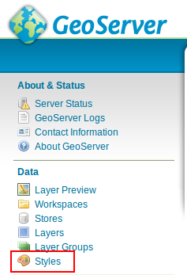
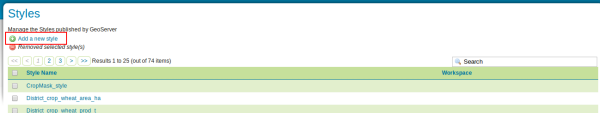
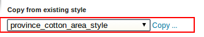
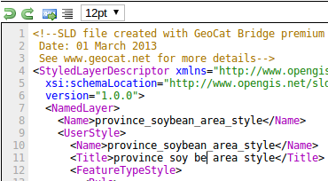
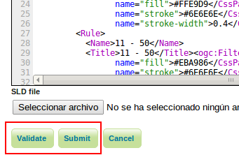
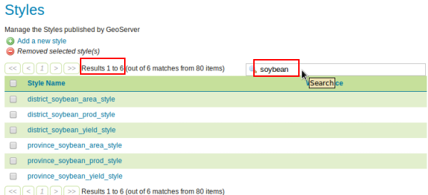
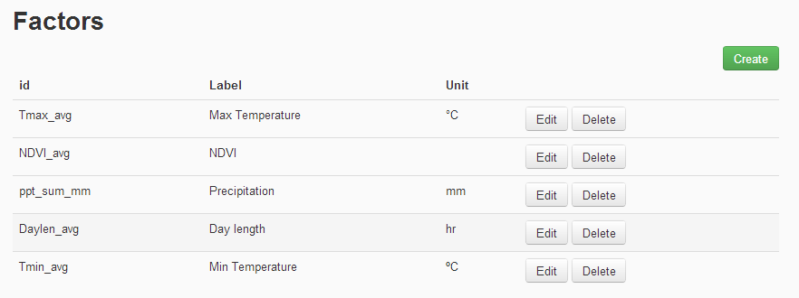
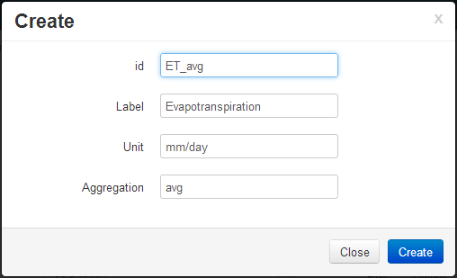
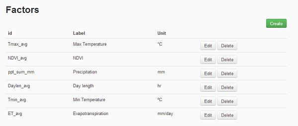

.. module:: cippak.admin.crop_agro
   :synopsis: Learn about how to manage Crops and Agromet factors.

.. _cippak.admin.crop_agro:

=========================
Crops and Agromet factors 
=========================

Manage Crops
============
To manage Crops you can click on the **Crops** link in the navigation bar or click on this link:

http://localhost:8080/admin/crops

.. figure:: img/crop_list.png

    The list of available crops

-----------------
Create a new Crop
-----------------

To create a new crop, click on the **Create** button. 
A form with the information to set will be displayed. 
complete the form as follows:

.. figure:: img/create_win.png

    Sample Soybean crop
    
The new crop will be shown in the Crops list.

.. figure:: img/crop_list2.png

    The new crop is added to the list
    
Anyway the new crop will not be available in MapStore until some data about the crop is ingested.

^^^^^^^^^^^^^^^^^^^^^^^^^^^^^^^^^^^^^^^^^
How to allow map generation for new Crops
^^^^^^^^^^^^^^^^^^^^^^^^^^^^^^^^^^^^^^^^^

To generate maps you **must** add 6 new styles to geoserver with a specific name::

    <province|district>_<crop_id_lower_case>_<area|prod|yield>_style

In the case above the styles to add will have the following names:

* ``province_soybean_area_style``
* ``province_soybean_prod_style``
* ``province_soybean_yield_style``
* ``district_soybean_area_style``
* ``district_soybean_prod_style``
* ``district_soybean_yield_style``

+++++++++++++++
Add a SLD style
+++++++++++++++

You can access to the style layer descriptor (SLD) definition page on GeoServer with `this link <http://localhost:8080/geoserver/web/?wicket:bookmarkablePage=:org.geoserver.wms.web.data.StyleNewPage>`_ or selecting *Styles* module on GeoServer:

    Styles module on GeoServer

and press on *add a new style*

    Add a new style button

Now, you have to fill the form with the new name, 

copy from one of the present one:

    Copy *province_cotton_area_style*

change the style with the new name and modify filters as you want:

copy from one of the present one:

    Edit the style

validate and submit the new style:

    Styles submit

++++++++++++++++
Complete example
++++++++++++++++

   .. note::  All resources for this exercise are present on the folder ``ROOT\training\data\crop_agro`` of the training. Please open the folder and use the files inside to complete the example.

We have attached data and styles for a complete proccess to add a new crop with data and styles to be used on the portal:

1. **Create the new crop**: follow the instructions in `Create a new Crop`_ section and create a new crop with the identifier *soybean*

2. **Create the styles**: Create a new style of each needed type (use xml files inside the training folder):

* ``province_soybean_area_style.xml``
* ``province_soybean_prod_style.xml``
* ``province_soybean_yield_style.xml``
* ``district_soybean_area_style.xml``
* ``district_soybean_prod_style.xml``
* ``district_soybean_yield_style.xml``

When you will finished this step you will be able to find all styles on your GeoServer: 

    Example's styles

3. **Import the data**: Follow the instructions on `CSV ingestion <../csv/index.html#operations>`_ section with the file ``soybean_10-12.csv``

4. **Test data**: Follow the instructions on `crop data tool <../../using/crop_data_tool/index.html>`_ section to use the new crop:

* `As map <../../using/crop_data_tool/index.html#output-type-map>`_. You must select a correct year in the range (2010-2012). The map should be something like that:

.. figure:: img/result_map.png
   :align:   center

    Expected map (Soybean 2010 - Yield)

* `As chart <../../using/crop_data_tool/index.html#output-type-chart>`_: You must select the correct interval (2010-2012) and district or provinces with data.

5. **Delete the test data**: Follow the instructions on `CSV ingestion <../csv/index.html#operations>`_ section with the file ``soybean_10-12_del.csv`` and change the zoom level. You should see the same color on all province/districts.

-----------------
Edit/Delete Crops
-----------------

You can edit/delete the crops clicking on the **Edit** and **Delete** buttons on the right of each row.

Manage Agrometeorological Factors
=================================
To manage Agrometeorological Factors you can click on the **Agromet Factors** link in the navigation bar or click on this link:

http://localhost:8080/admin/agromet/

    The list of available factors

-------------------
Create a new Factor
-------------------

To create a new factor, click on the **Create** button. 
A form with the information to set will be displayed. 
complete the form as follows:

    Sample Evapotranspiration factor
    
The new factor will be shown in the Crops list.

    The new factor is added to the list
    
Anyway the new factor will not be available in MapStore until some data about the factor is ingested.

-------------------
Edit/Delete Factors
-------------------

You can edit/delete the factor clicking on the **Edit** and **Delete** buttons on the right of each row.

    

