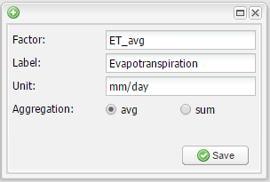

.. module:: cippak.admin.crop_agro
   :synopsis: Learn about how to manage Crops, Agromet Variables and Units of Measure.

.. _cippak.admin.crop_agro:

=============================================
Crops, Agromet Variables and Units of Measure
=============================================

To manage Crops, Agromet Variables and Units of Measure you can use the **Entities manager** tool in the Administration Page

    Entities Manager tool

Manage Crops
============
-----------------
Create a new Crop
-----------------

| To create a new crop, click on the **Create** button. A form with the information to set will be displayed.
| Complete the form as follows:

    Sample Soybean crop

The new crop will be shown in the Crops list.

    The new crop is added to the list

Anyway the new crop will not be available in MapStore until some data about the crop is ingested.

.. raw:: latex

  \newpage % hard pagebreak at exactly this position

^^^^^^^^^^^^^^^^^^^^^^^^^^^^^^^^^^^^^^^^^
How to allow map generation for new Crops
^^^^^^^^^^^^^^^^^^^^^^^^^^^^^^^^^^^^^^^^^

To generate maps you **must** add 6 new styles to geoserver with a specific name::

    <province|district>_<crop_id_lower_case>_<area|prod|yield>_style

In the case above the styles to add will have the following names:

* ``province_soybean_area_style``
* ``province_soybean_prod_style``
* ``province_soybean_yield_style``
* ``district_soybean_area_style``
* ``district_soybean_prod_style``
* ``district_soybean_yield_style``

.. note:: This styles are needed to generate maps in the *Crop Data* module of *MapStore*.

        * Area Type: National(Province)
            * ``province_soybean_area_style.xml``:  style to generate maps for area.
            * ``province_soybean_prod_style.xml``:  style to generate maps for production.
            * ``province_soybean_yield_style.xml``: style to generate maps for yield.

        * Area Type: National(District) or Province(District)
            * ``district_soybean_area_style.xml``:  style to generate maps for area .
            * ``district_soybean_prod_style.xml``:  style to generate maps for production.
            * ``district_soybean_yield_style.xml``: style to generate maps for yield.

.. raw:: latex

  \newpage % hard pagebreak at exactly this position

+++++++++++++++
Add a SLD style
+++++++++++++++

You can access to the style layer descriptor (SLD) definition page on GeoServer with `this link <http://localhost:8888/geoserver/web/?wicket:bookmarkablePage=:org.geoserver.wms.web.data.StyleNewPage>`_ or selecting *Styles* module on GeoServer:

    Styles module on GeoServer

.. raw:: latex

  \newpage % hard pagebreak at exactly this position

and press on *add a new style*

    Add a new style button

Now, you have to fill the form with the new name, for this exercise you can copy a style from the existing ones.

    Copy *province_cotton_area_style*

change the style with the new name and modify filters as you want:

copy from one of the present one:

    Edit the style

.. raw:: latex

  \newpage % hard pagebreak at exactly this position

validate and submit the new style:

    Styles submit

To see a complete example of how to add a crop see :ref:`Complete Example<cippak.admin.crop_agro.complete>` .

-----------------
Edit/Delete Crops
-----------------

You can edit/delete the crops clicking on the **Edit** and **Delete** buttons on the right of each row.

Manage Agrometeorological Variables
===================================
---------------------
Create a new Variable
---------------------

| To create a new variable, click on the **Create** button. A form with the information to set will be displayed.
| Complete the form as follows:

    Sample Evapotranspiration variable

The new variable will be shown in the Crops list.

    The new variable is added to the list

Anyway the new variable will not be available in MapStore until some data about the variable is ingested.

---------------------
Edit/Delete Variables
---------------------

You can edit/delete the variable clicking on the **Edit** and **Delete** buttons on the right of each row.

.. note:: ``NDVI_avg`` is used in a special way from the system, so it should never be deleted. otherwise the ingestion of
          generated statistics from the NDVI statistics module will not work.

================
Complete example
================

You can follow a complete example adding the data and styles and testing it on mapstore

.. toctree::
   :maxdepth: 1

   Complete Example <complete>

===============
Unit of Measure
===============

The units of measure used in the crop information portal can be configured here.

    The unit of measure table

The attribute of a unit of measure object are:

* **id**: the identifier of the unit of measure
* **Label**: the label to use for this unit of measure
* **Short Name**: a short version of the label used in charts when needed.
* **Description**: a description of the unit of measure, is optional.
* **Class**: represent where this unit of measure is used in the system.
  Can be one of:
  * area: used for areas in crop data tool
  * production: used for production in crop data tool
  * yield: used for yield in crop data tool
  * denominator: used as a denominator in market prices tool (e.g. USD/**40kg**)
  * currency: only one is allowed. USD.
  * exchangerate: stores the current exchange rate PKR/USD. you can change the
    value of this with recent
  * waterflaw: used for waterflow values in irrigation tool
  * watersupply: used for water supply values in irrigation tool
* **filter**: used only for production in crops. Can be populated with a
  comma-separated list of crop_id to use the unit of measure only with the crops
  listed.

As for the other entities you can create a new unit of measure clicking on the
"Create" button

    Create a new unit of measure

Clicking on the pencil in the table row you can edit a unit of measure.

    Edit a unit of measure.
