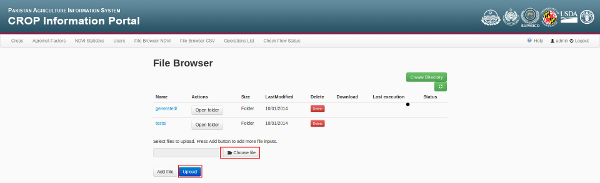
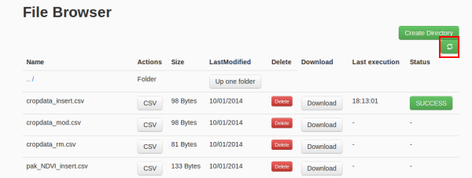
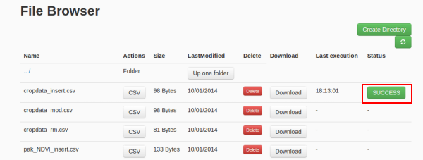
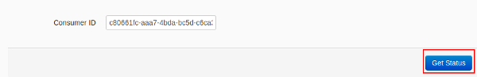

.. module:: cippak.admin.csv
   :synopsis: Learn about how to ingest from CSV files and download generated data.

.. _cippak.admin.csv:

CSV Browser 
===========

This section explain how to use CSV Browser to allow:

* Create
* Update
* Delete

records on agromet, crop data and crop status tables.

To access to this module you need to click on the navigation bar button 'File Browser CSV'

.. figure::  resources/csv_browser.png	
   :align:   center

   CSV Browser on navigation bar.

Now you can upload your files te make the ingestion. The file operation and the target table depends on the CSV files you upload.

Known CSV formats
-----------------

The target table depends on header row of the CSV file to be ingested and can be:

* Agromet
* Crop data
* Crop status

Agromet
+++++++

The header for an agromet operation must be::

	*,distr,prov,year,mon,dec,factor,*

and the values must be correct values for the database. For example::

	rowId,distr,prov,year,mon,dec,factor,NDVI_avg
	,Bolan,BALOCHISTAN,2013,Jan,1,fake_arg,100
	2,Bolan,BALOCHISTAN,2013,Feb,1,fake_arg,200

The first column is ignored, the columns 'distr', 'prov', 'year', 'mon', 'dec' and 'factor' are the composed primary key of the database and the last column is the value of the agromet factor.

Crop Data
+++++++++

The header for an agromet operation must be::

	*,crop,distr,prov,year,years,area,prod,yield

and the values must be correct values for the database. For example::

	id,crop,distr,prov,year,years,area,prod,yield
	dummy,rice,fake_dist,fake_prov,2000,2000-2005,1,1,1

The first column is ignored and the other columns are the cropdata table columns. The primary key is composed by columns: 'crop', 'district', 'province' and 'year'.

Crop status
+++++++++++

The header for an agromet operation must be::

	*,factor,crop,month,dec,max,min,opt,

and the values must be correct values for the database. For example::

	rowid,factor,crop,month,dec,max,min,opt,
	1,"Tmax_avg","fake_crop_2","Apr",1,16,42,15,20
	1,"Tmax_avg","fake_crop_2","May",1,16,42,15,20

The first column is ignored and the other columns are the cropdata table columns. The primary key of this table is composed by: 'crop', 'month', 'factor' and 'dec' columns.

Operations
----------

For the each file operation you need to know what is the primary key columns of the table to be updated. The run of the ingestion is equals on the three known operations:

1. **Upload the file**: Select a file from your file system and click on *Upload*

   Upload a file.

2. **Execute the ingestion**: Click on *CSV* button.

.. figure::  resources/CSV_click.png	
   :align:   center

   CSV button.

3. **Update the file browser status**: If you want, you can see the ingestion status, but if the file is big, you won't be able to view the resume before the ingestion will be finished. In this case, you will be able to update the file browser status and wait for a '*SUCCESS*' or '*FAIL*' message on the file.

   Update button.

4. **See the log**: Click on '*SUCCESS*' or '*FAIL*' message on the file 

   SUCCESS button.

and on '*Get status*' button on the next page. 

   Get status button.

Then the log of the execution will be shown in the page. If the message is '*SUCCESS*' should appear a resume with the status of the CSV ingestion::

	***************************************************
	********** SUCCESS: CSV ingestion resume **********
	***************************************************
	* Records inserted: 1
	* Records updated: 0
	* Records removed: 0
	* Falied records: 0
	***************************************************

We have attached an example for each operation for each table.

Create
++++++

You need to create a CSV file with the new entry inside.

Examples:

* `Agromet <https://github.com/geosolutions-it/OpenSDI-Manager/raw/c3c5ffac7789b428b552d7e021bd763b80456557/geobatch/csvingest/src/test/resources/testdata/pak_NDVI_insert.csv/>`_
* `Crop data <https://github.com/geosolutions-it/OpenSDI-Manager/raw/c3c5ffac7789b428b552d7e021bd763b80456557/geobatch/csvingest/src/test/resources/testdata/cropdata_insert.csv/>`_
* `Crop status <https://github.com/geosolutions-it/OpenSDI-Manager/raw/c3c5ffac7789b428b552d7e021bd763b80456557/geobatch/csvingest/src/test/resources/testdata/pak_cropstatus_insert_fake.csv/>`_

Update
++++++

You need to create a CSV file with the primary key of the row to be updated and change the value to be updated. 

Examples:

* `Agromet <https://github.com/geosolutions-it/OpenSDI-Manager/blob/c3c5ffac7789b428b552d7e021bd763b80456557/geobatch/csvingest/src/test/resources/testdata/pak_NDVI_modify.csv/>`_
* `Crop data <https://github.com/geosolutions-it/OpenSDI-Manager/raw/c3c5ffac7789b428b552d7e021bd763b80456557/geobatch/csvingest/src/test/resources/testdata/cropdata_mod.csv/>`_
* `Crop status <https://github.com/geosolutions-it/OpenSDI-Manager/raw/c3c5ffac7789b428b552d7e021bd763b80456557/geobatch/csvingest/src/test/resources/testdata/pak_cropstatus_mod_fake.csv/>`_

Delete
++++++

You need to create a CSV file with the primary key of the row to be deleted and put all the other columns to null. 

Examples:

* `Agromet <https://github.com/geosolutions-it/OpenSDI-Manager/raw/c3c5ffac7789b428b552d7e021bd763b80456557/geobatch/csvingest/src/test/resources/testdata/pak_NDVI_rm.csv/>`_
* `Crop data <https://github.com/geosolutions-it/OpenSDI-Manager/raw/c3c5ffac7789b428b552d7e021bd763b80456557/geobatch/csvingest/src/test/resources/testdata/cropdata_rm.csv/>`_
* `Crop status <https://github.com/geosolutions-it/OpenSDI-Manager/raw/c3c5ffac7789b428b552d7e021bd763b80456557/geobatch/csvingest/src/test/resources/testdata/pak_cropstatus_remove_fake.csv/>`_