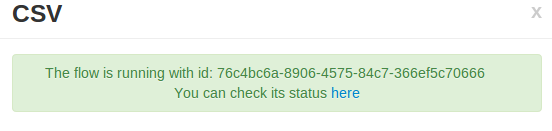
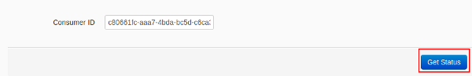
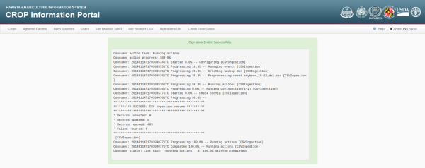
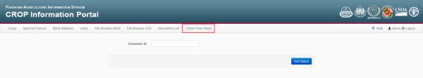
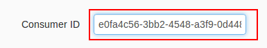
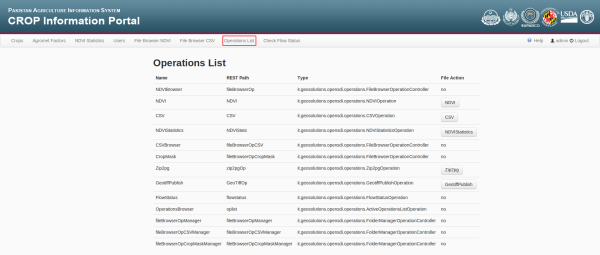

.. module:: cippak.admin.misc
   :synopsis: Learn about how flow status and operation list modules.

.. _cippak.admin.misc:

.. raw:: latex

  \newpage % hard pagebreak at exactly this position   

Flow Status
===========

When you execute CSV ingestion, NDVI publishing or statistics generation, you start a flow execution on GeoBatch. Wile running, an identifier will be associated to that flow execution. We call this identifier the **Consumer ID**

   CSV execution. the *Consumer ID* is: *76c4bc6a-8906-4575-84c7-366ef5c70666*

Clicking on the link (*here*), you will be redirected to the *Flow Status* page. You can see the *Consumer ID* in the textbox and the *Get Status* button.

   Get status button.

Clicking on the '*Get status*' button you will see the current log for the flow execution you started: 

   Message log.

The id of the flow is **volatile**. It means that if you switch the page after the execution, you must save the id if you want to access again to the log page for that flow execution.

.. note:: In the file browsers (CSV or NDVI), when you launch an operation for a file (e.g. CSV ingestion, NDVI publish), the application will save the last execution of a process for that file ( last execution and Status columns). Than you can resume the log clicking on the status button.
          For more complex operations like NDVI Statistics you have to save the *Consumer ID* manually to recover the status of the process. Anyway, the full log for the operations execution is not stored forever.

If you have saved a *Consumer ID* and you want to see the log, you have to

1. press on ``Check Flow Status`` on the navigation bar, 

   Get status module.

2. paste the *Consumer ID* in the textbox

   Consumer ID parameter.

3. Press on *Get Status* button.

   Get status button.

The log will appear again on your browser.   

Operation List
==============

The Operation List module is available clicking on *Operation List* in the navigation bar.

   Operation list module.

This module show a resume of available operations on the application. For each available operation will show:

* **Name**: Name of the operation
* **REST path**: Used to access to the view of the operation and interact with this.
* **File Action**: Indicates if the file can be executed with a file.