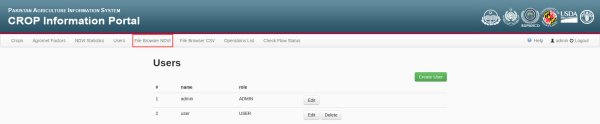
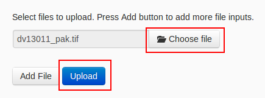
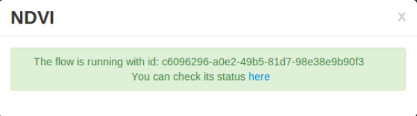
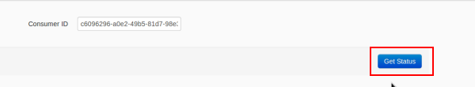
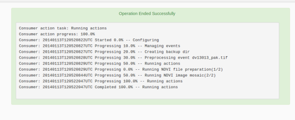

.. module:: cippak.admin.ndvi
   :synopsis: Learn about how to publish NDVI images.

.. _cippak.admin.ndvi:

NDVI Browser
============

This module is designed to learn how to deploy new NDVI images on the server. 

To access to this module you can follow `this link <http://localhost:8083/admin/operationManager/fileBrowserOp/NDVI>`_ or press the button on the navigation bar:

   NDVI browser module link.

This operation publish a new Geotiff image for a date interval on the NDVI layer.

File format
-----------

The name of the Geotiff file must have this format: `dvYYMMD_*.tif` with:

* **YY**: Year of the image: two last digits of the year: 1998 --> 98; 2000 --> 00.
* **MM**: Month of the image: between 01 (January) and 12 (December)
* **D**: Dekad of the image: 1, 2 or 3

Execution flow
--------------

The execution flow for this operation is:

1. **Upload the new NDVI**: Select the Geotiff file to upload.

2. **Execute the ingestion**: Press on *NDVI* button on the uploaded file.

   Upload button.

3. **Update the file browser status**: If you want, you can see the ingestion status, 

   Get status after execution.

but if the file is big, you won't be able to view the resume before the ingestion will be finished. In this case, you will be able to update the file browser status and wait for a '*SUCCESS*' or '*FAIL*' message on the file.

.. figure::  resources/update.png	
   :align:   center

   Update button.

4. **See the log**: Click on '*SUCCESS*' or '*FAIL*' message on the file 

.. figure::  resources/success.png	
   :align:   center

   SUCCESS button.

and on '*Get status*' button on the next page. 

   Get status button.

If the ingestion status is SUCCESS, 

   Status of the execution.

you can view the new granule on the different NDVI selectors:

* `NDVI statistics <../stats/index.html>`_
* `NDVI tool <../../using/ndvi_tool/index.html#select-dekad>`_