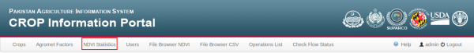
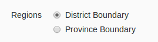
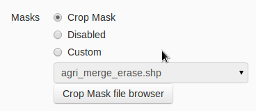
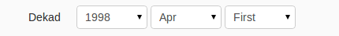
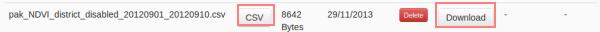
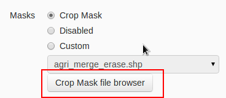
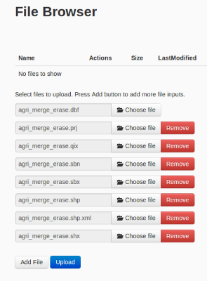

.. module:: cippak.admin.stats
   :synopsis: Learn about how to manage Crops and Agromet factors.

.. _cippak.admin.stats:

NDVI Statistics
===============

This browser module allow you to generate a CSV with NDVI statistics.

To access it you can follow `this link <http://localhost:8083/admin/operationManager/fileBrowserOp/NDVI>`_ or press the button on the navigation bar:

   NDVI statistics module link.

Now you must complete the form:

* **Region**: indicates if the statistics will be generated for each province or for each district. The default selection is ``district boundary``

   Regions selector

* **Mask**: select a mask to be applied on the NDVI statistics generation. You can select the default ``Crop Mask`` (default), disable it or a ``Custom`` crop mask.

   Masks selection.

* **Dekad**: to select a dekad you must select the year, the month and the dekad of available dekads. As you know, avilable dekads are loaded from the NDVI layer on GeoServer. If you want to add a new dekad, you must follow the instructions of the `NDVI file browser <../ndvi/index.html>`_ section.

   Dekad selection.

Then you must press on `Generate statistics`. When the the process will succeed, it will appear the generated CSV with the syntax on the `CSV browser <../csv/index.html>`_ module on generated folder with the name linked to the selected form:

* `pak_NDVI_${region}_${crop mask}_${start date}_${end date}`

You can ingest as a `CSV browser operation <../csv/index.html#operations>`_ or simply download it to check the data.

   Generated CSV.

Crop mask file browser
----------------------

If you want to use a custom crop mask, it's probably that you need to upload it before execute the NDVI statistics action. Please follow this instructions:

1. **Open 'Crop Mask file browser'**: Press on this button

   Crop mask file browser button.

2. **Upload shp files**: Upload the shape file and it dependencies one by one with the file uploader.

   Crop mask file browser upload.

Now you can select the new crop mask as ``custom mask`` on the NDVI statistics form.