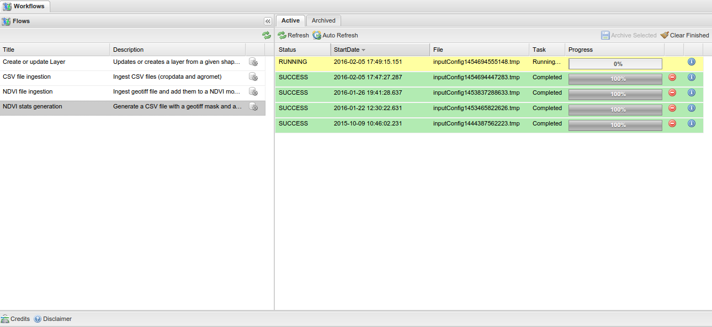
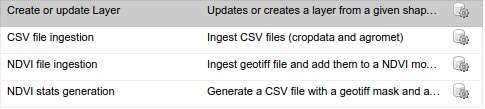
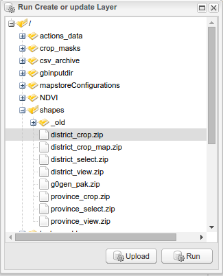
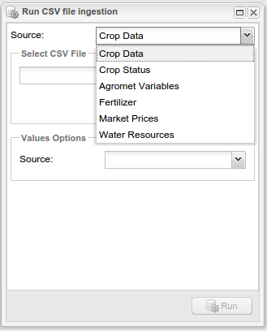
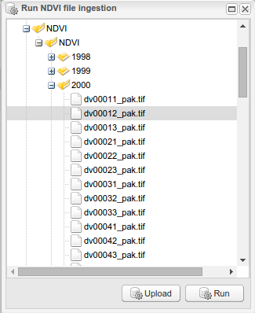
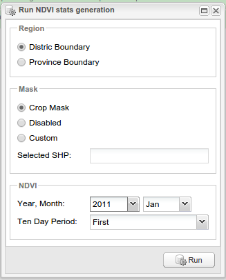

.. module:: cippak.admin.workflows
   :synopsis: Introduction to the Workflows

.. _cippak.admin.workflows:

***********************
The Workflows Tool
***********************

The "Workflows" tool provide functionalities to run common tasks on the server.

The available flows are:

* Create or Update Layer
* CSV file ingestion
* NDVI ingestion
* NDVI stats generation

Create or update Layer
^^^^^^^^^^^^^^^^^^^^^^

This flow allows to insert or update an existing vector layer in the database using a :term:`shape file`
as input. The system use the name of the shape file to publish a new spatial table
on the database, or to update an existing one.

CSV file ingestion
^^^^^^^^^^^^^^^^^^

This flow allows to update the data of the crop information portal using the csv file.
This is the main way to update:

* Crop Data
* Agromet Variables Data
* Fertilizers Data
* Irrigation Data
* Market prices Data
* Crop Status Limits

Each CSV type has its own format and its own options.

NDVI ingestion
^^^^^^^^^^^^^^

This flow allows to update the NDVI images published on the server. The system parse
the file name to identify the :term:`dekad` for the image.

for instance the dv16013_pak.tif is related to 2016, Jan, 3rd dekad.

NDVI stats generation
^^^^^^^^^^^^^^^^^^^^^

Generates statistics from the NDVI images published on the server, in CSV format.
The generated CSV file can also be used in the *CSV file ingestion* flow to update the
values of the NDVI Agromet Variable.

