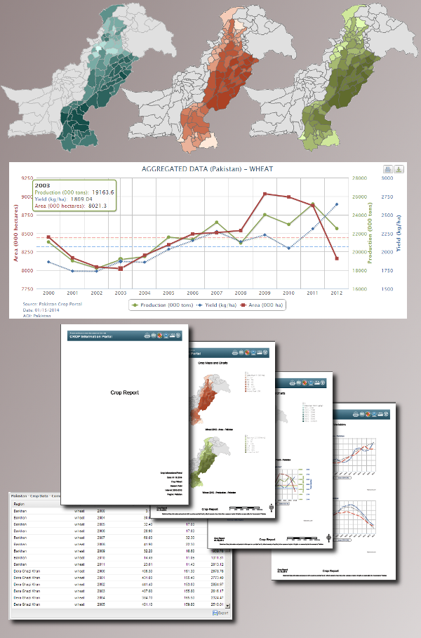
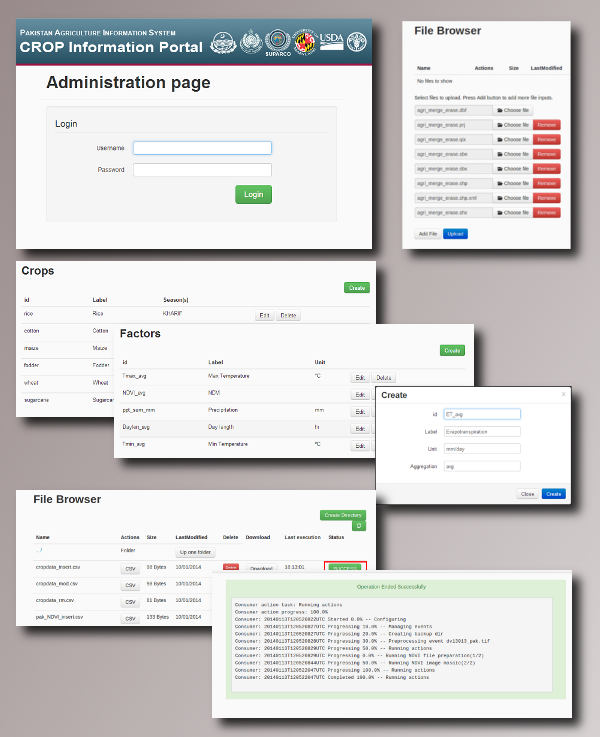

.. module:: cippak.overview
   :synopsis: Crop Information Portal overview.

.. _cippak.overview:

Overview
--------

The Crop Information Portal is a component of the Pakistan Agriculture Information System. 
Supports Crop Reporting Services in data and information dissemination on Pakistan's major crops (wheat, maize, rice, cotton and sugarcane) and agro-meteorological conditions affecting crop growth.

.. figure::  img/mapstore1.png  
   :align:   center

   The Main User Interface.

Crop Information Portal makes available to WEB users the historical archive and the latest produced crop and agro-meteorological
data aggregated at district/province scale and integrated with satellite based information into a GIS like environment.

.. figure::  img/mapstore2.png  
   :align:   center

   Usage of the GIS like environment.

It Allows advanced filtering of the data archive based on the combination of user defined spatial and temporal parameters,
focusing on specific crops or environmental factors, which are stored into the system, to produce standard outputs such as summary tables,
maps, charts and user defined reports.

   The various output formats.

It Provides also a SITS( *Satellite Image Time Series* ) of the the NDVI( *Normalized Difference Vegetation Index* ) at 10 days interval ( *dekad* ).

.. figure::  img/ndvi.png  
   :align:   center

   The NDVI image from the SITS.

The Portal provides also an administration interface to allow the administrators to update the information available on the server and process satellite images to obtain some statistical data.

   The administration interface.