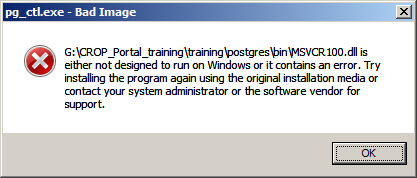

.. module:: cippak.system_config
   :synopsis: Learn how to configure the system.

.. cippak.system_config:

=======================
Training Configurations
=======================

In this section will be described all the convenctions used in this training and how to run and access to the applications.

Conventions used in this documentation
======================================

#. **The base path of the training**

The training pages often reference resources contained in the package. Since the package can be extracted anywhere in the filesystem that location will be referred as **ROOT**.

Example:

If the package is extracted in the FileSystem location ``c:\CROP_Portal_training`` and a section of the training refers the resource contained in ``ROOT\training\data`` the absolute path of that resource will be ``c:\CROP_Portal_training\training\data``.

Package structure and contents
==============================

#.  **training** directory

    Contains All the data (both vector and raster), all the applications deployed on tomcat, the posgis instance with the DB needed and some useful application like `pgAdmin <http://www.pgadmin.org/>`_ and `GDAL <http://www.gdal.org/>`_ . The most important subdirectories are:

	* **data_dirs**
	
	This directory contains the **Geobatch Config Dir** (*GEOBATCH_CONFIG_DIR*), the **Geoserver Data Dir** (*gs_data_dir*) and the root directory where the FileBrowser operations works (see the :ref:`cippak.admin` section)
	
	* **gdal**
	
	At this location there are the binaries of the GDAL utilities.
	
	*  **jdk**

	The embedded java.
	
	* **postgres**
	
	The postgres instance.
	
	* **tomcat-6.0.36**
	
	The tomcat CATALINA_HOME and CATALINA_BASE directories with the applications that composes the crop portal deployed as exploded web archive.

#.  **pgAdmin.bat**

    Run a pgAdmin instances already configured for the connection with the DataBase used in the Portal.
    
#.  **postgis_start.bat**

    Starts the postgres server
	
#.  **postgis_stop.bat**

    Stops the postgres server

#.  **README.txt**

    Basic Instructions to run the training
    
#.  **training-startup.bat**

    Startup all the training applications.
    
As you can see this package contains all that you need to have a fully functional environment to run the CROP Portal on any windows machine.

Run the training
================

#. Extract the package anywhere in the filesystem

#. Run the script ``ROOT\training-startup.bat``

Five Windows will be open: One will be related to the postgres instance and the other four to the related tomcat instances. The logs of the application could be checked in those windows.

.. warning:: Closing a windows means close all the applications deployed on that tomcat. Keep all the applications open in order to access to all the applications that compose the platfrom.

Access to the applications at the following URLs:

#. http://localhost:8080/geoserver

#. http://localhost:8083/admin

#. http://localhost:8081/geobatch

#. http://localhost:8082/geostore/rest

#. http://localhost:8083/MapStore/

troubleshooting
===============
Depending on your windows version, when you run the training you can have this error:

To solve the issue you have replace the following dll files 

#. ``msvcr100.dll``
#. ``msvcp100.dll``

in the directory ``<training-root>/postgres/bin/``. You can find the dll files in your windows installation at 

* ``c:\windows\syswow64``

or if you don't have the directory above you can get them from the directory below: 

* ``c:\windows\system32``

As the old files are replaced with the ones from your windows installation you can run the training as usual. 
