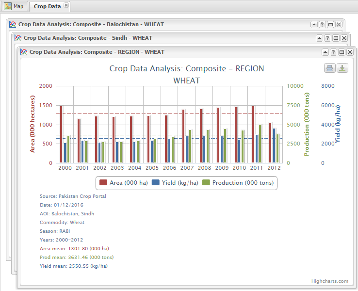
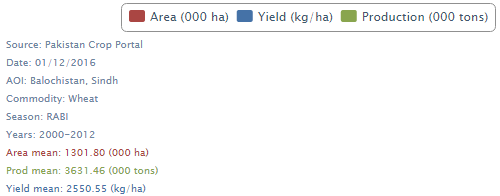
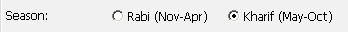
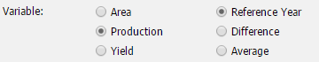
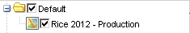
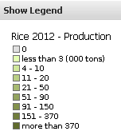

.. module:: cippak.using.crop_data_tool
   :synopsis: How to use Crop Data Tool

.. _cippak.using.crop_data_tool:

Crop Data Tool
===========================

This section illustrates how you can use **Crop Data Tool**.

***********************************
Tab to interact with Crop Data Tool
***********************************

**Crop Data Tool** is located in the west of the layout and allows you to generate charts and maps dynamically aggregating yearly data about production, cultivated areas and yield of each crop.

    .. figure:: img/cropdata_tool.png

                Crop Data Tool.

Generate a Chart
^^^^^^^^^^^^^^^^

To generate charts that describes the trend of the wheat production choose "Chart" as output type and select the Season, the Area of interest and the range of years in which you are interested.

Choose Output Type Chart:

.. figure:: img/output_chart.png

    Choose Output Type Chart.

Choose Season:

.. figure:: img/season_choice.png

    Choose Season.
                
Choose Area Of Interest: 

.. figure:: img/aoi_choice.png

    Choose Area Of Interest.

.. raw:: latex

  \newpage % hard pagebreak at exactly this position

Area Of Interest selection:

.. figure:: img/output_chart_choices_highlight.png

    Area Of Interest selection.
    
Choose Commodity: 

.. figure:: img/commodity_choice.png

    Choose Commodity.

Choose Years Range: 

.. figure:: img/range_year_choice.png

    Choose Years Range.

.. raw:: latex

  \newpage % hard pagebreak at exactly this position

Generate Chart Button: 

.. figure:: img/generate_chart_button.png

    Generate Chart Button.

Generated Charts: 

    Generated Charts.

.. raw:: latex

  \newpage % hard pagebreak at exactly this position

Charts Legend: 

    Charts Legend.                 

Generate a Map
^^^^^^^^^^^^^^

To generate a map that describes the trend of the rice production choose "Map" as output type and select the Season, the Area of interest and the range of years in which you are interested.

Choose Output Type Map:

.. figure:: img/output_map.png

    Choose Output Type Map.

Choose Season:
                

    Choose Season.

.. raw:: latex

  \newpage % hard pagebreak at exactly this position

Choose Area Of Interest:

.. figure:: img/aoi_choice_map.png

    Choose Area Of Interest.
                
.. raw:: latex

  \newpage % hard pagebreak at exactly this position

Area Of Interest selection:
                
.. figure:: img/output_map_choices_highlight.png

    Area Of Interest selection.

Choose Commodity:

.. figure:: img/commodity_choice_map.png

    Choose Commodity.

Choose Years Range:

.. figure:: img/range_year_choice.png

    Choose Years Range.
                
.. raw:: latex

  \newpage % hard pagebreak at exactly this position

Choose Variable:

    Choose Variable.   

Generate Map Button:

.. figure:: img/generate_map_button.png

    Generate Map Button.

Generated Map Layer:

    Generated Map Layer.
                
.. raw:: latex

  \newpage % hard pagebreak at exactly this position

Generated Map:

.. figure:: img/output_map_viewmap.png

    Generated Map.

Generated Map Legend:
                

    Generated Map Legend.

.. raw:: latex

  \newpage % hard pagebreak at exactly this position

Smart Identification tool
"""""""""""""""""""""""""

This tool allows you to query the map generated by Crop Data Tool. You must first select the generated layer from the Layer Switcher panel.

    .. figure:: img/smart_map_identification_tool.png

                Smart Map Identification Tool.

    .. figure:: img/smart_map_identification.png

                Smart Map Identification.

.. raw:: latex

  \newpage % hard pagebreak at exactly this position

Generate Tabular data
^^^^^^^^^^^^^^^^^^^^^

This option allows you to generate tabular data and download it as Comma Separated Value (CSV).
This option is enable only for logged in users and it is also available for **Crop Status Tool** and **Agromet Tool**

Click on the login button.

    .. figure:: img/login.png

                Login button.
                
Enter your credential.

    .. figure:: img/login_form.png

                Login Form.
                
If the credentials are ok the option Data is enable in the Output Type radio button.

    .. figure:: img/output_data.png

                Output type Data.

.. raw:: latex

  \newpage % hard pagebreak at exactly this position

To generate tabular data and download it as Comma Separated Value (CSV) of the rice production choose "Data" as output type and select the Season, the Area of interest and the range of years in which you are interested.

Select the season: Rabi or Kharif:

    .. figure:: img/season_choice_map.png

                Choose Season.

Select the Area Of Interest:

    .. figure:: img/aoi_choice_data.png

                Choose Area Of Interest.

.. raw:: latex

  \newpage % hard pagebreak at exactly this position

the selected zones are highlighted on the map:
                
    .. figure:: img/output_map_choices_highlight.png

                Area Of Interest selection.

Note that the red disk icon allows to remove item(s) from the list. Also re-clicking on a shape makes the same shape to be deselected. Additional note, if you want a specific area you do not know where it is but you know its name, you can use the Add (+)  button: an input box for searching the DB pops up. 

Select a commodity:

    .. figure:: img/commodity_choice_map.png

                Choose Commodity.

Select the time interval by using the dedicated slider. It defines the range for averages and the reference year (highest). The default range is the max available. 

    .. figure:: img/range_year_choice.png

                Choose Years Range.

.. raw:: latex

  \newpage % hard pagebreak at exactly this position

Select the factor to analyze. 

    .. figure:: img/variable_choice_map.png

                Choose Variable.                

Click on the ``Generate Data Button`` button

    .. figure:: img/generate_data_button.png

                Generate Data Button.

.. raw:: latex

  \newpage % hard pagebreak at exactly this position

The result is a formatted table (AgroMet Tables near the View tab) of source values.
                
After clicking on the button will open a grid where the information will be listed in tabular form.

    .. figure:: img/generate_tabular_data_grid.png

                Tabular Data Grid.
                
Factor values (e.g. NDVI) are listed by dekad and month. Three columns provide data for reference year, previous and selected time interval (average).  All factors are included in the same table.

Now you can export the data in CSV format and save them on your PC.

If you have selected one or more provinces, you can export the data for only one province or districts belonging to the province.
If you have selected a district can export only the data for the district.

The icon at the bottom right corner  allows the data to be exported as CSV file.

    .. figure:: img/export_data_buttons.png

                Export Data Buttons.