.. module:: cippak.using.reporting_tool
   :synopsis: How to use Reporting Tool

.. _cippak.using.reporting_tool:

Reporting Tool
===========================

This module is responsible of the PDF report generation that includes data charts and specific maps with the aggregated data.

To generate a report you need:

* Season
* Area of interest (AoI)
	* Type
	* Zones
* Commodity
* Range
* Meteorogical factors
* Layout configuration

To access to this module, please press on ``Crop Report`` button on the user interface:

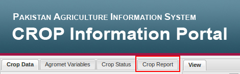

   Button for the Crop Report module.

Season
------

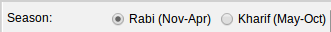

   Season selection.

Area of interest
----------------

You can select province, district or Pakistan.

For province and district selection you need to select the selected zones with the ``Add`` button

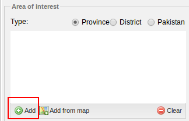

   Add button.

and search the zone to add: 

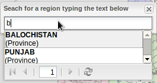

   Search autocomplete.
                
.. raw:: latex

  \newpage % hard pagebreak at exactly this position

or ``Add from the map``

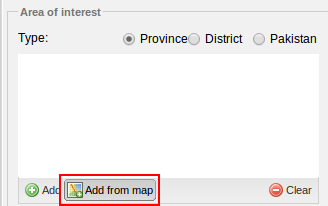

   Add from the map.

and click on the map on the zone to be added.
                
.. raw:: latex

  \newpage % hard pagebreak at exactly this position

In both options, the zone will be added into the AoI grid

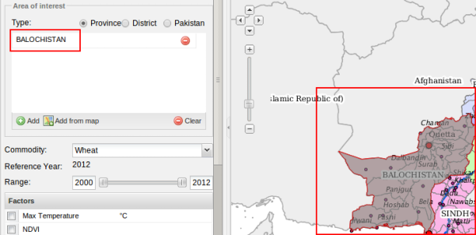

   Balochistan province selected as AoI.
                
.. raw:: latex

  \newpage % hard pagebreak at exactly this position

If you select ´Pakistan´, you don't have to select any AoI:

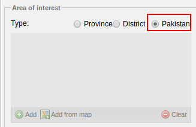

   Pakistan as AoI.

Commodity
---------

Select the commodity for the report.

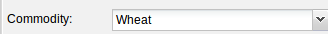

   Wheat as commodity.

Range
-----

Select the range for the report. The last year of the range will be selected as ``Reference year`` for the map.

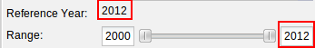

   Range and reference year selection.

Meteorogical factors
--------------------

Select the factors for the report. You can select one or more of this factors

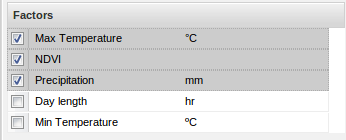

   Range and reference year selection.

Layout configuration
--------------------

In this section you can customize a litle bit the generated report.

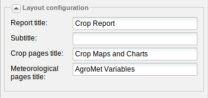

   Default layout configuration.

* **Report title**: Title for the report (appear on the first page of the report)
* **Subtitle**: Subtitle for the report (appear on the first page of the report)
* **Crop pages title**: Title for the pages with maps and charts with the aggregated data
* **Meteorological pages title**: Title for pages with meteorogical variables charts (the number of charts and pages depends on your factor selection)

Keep calm
---------

Then you must press on ``Generate Report``

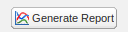

   Generate button.

and wait for the report generation.

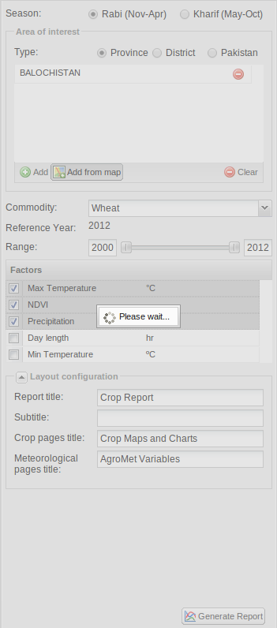

   Wait for the report generation.

We process a lot of data and render it on a PDF document. When the report will be finished, your browser will ask you if you want to download the PDF file.

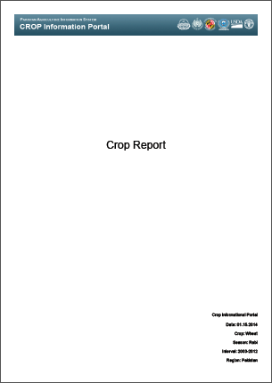
   
   The PDF cover
   
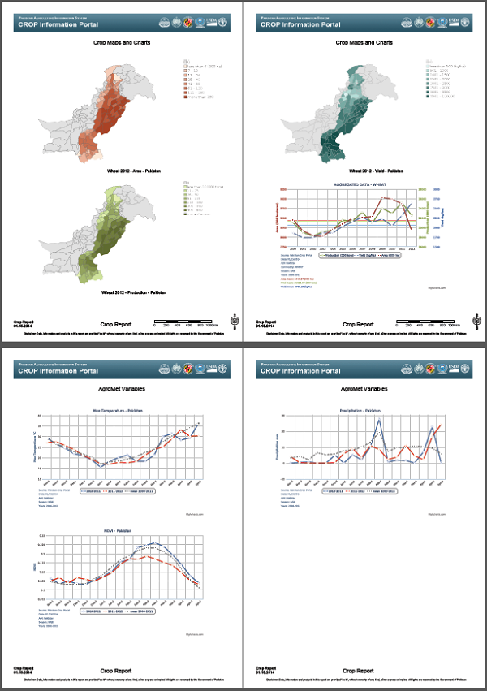
   
   The PDF content