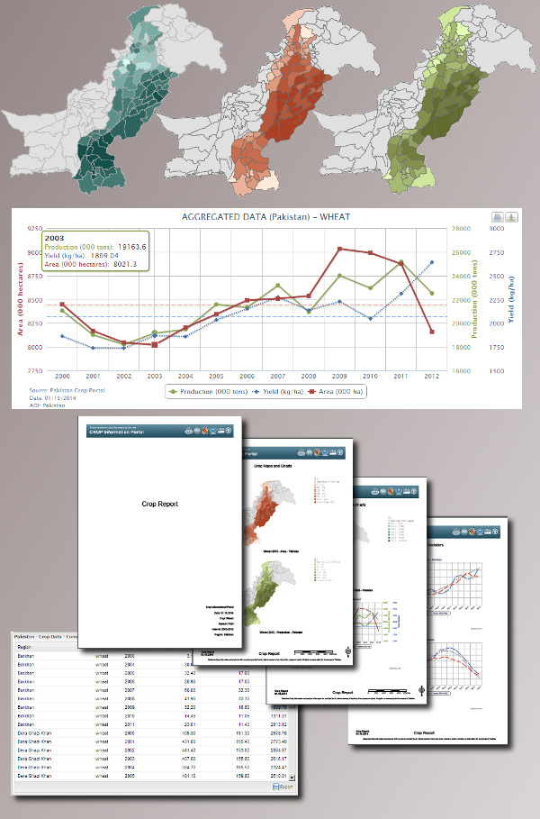

.. module:: cippak.overview
   :synopsis: Crop Information Portal overview.

.. _cippak.overview:

Overview
--------

**Crop Information Portal** is a web portal with reliable data and information on historical
and current crop data anda agro-metereological condition in Pakistan. It allows users to 
extract statistics and detect conditions affecting production of major Rabi and Kharif crops.

   The Main User Interface.

The Crop Information Portal is a component of the Pakistan Agriculture Information System. 
Supports Crop Reporting Services in data and information dissemination on Pakistan's major crops (wheat, maize, rice, cotton and sugarcane) and agro-meteorological conditions affecting crop growth.

.. raw:: latex

  \newpage % hard pagebreak at exactly this position

Crop Information Portal makes available to WEB users the historical archive and the latest produced crop and agro-meteorological
data aggregated at district/province scale and integrated with satellite based information into a GIS like environment.

The whole system is based on MapStore (http://mapstore.geo-solutions.it/). MapStore has been developed to create, save, browse and share in a simple and intuitive way mashups created using content from source servers like Google Maps, OpenStreetMap, MapQuest or more. MapStore consists of two main components: MapManager and GeoStore, respectively front-end and back-end. Here is described the front-end component.

   Usage of the GIS like environment.

.. raw:: latex

  \newpage % hard pagebreak at exactly this position

It Allows advanced filtering of the data archive based on the combination of user defined spatial and temporal parameters,
focusing on specific crops or environmental factors, which are stored into the system, to produce standard outputs such as summary tables,
maps, charts and user defined reports.

   The various output formats.

.. raw:: latex

  \newpage % hard pagebreak at exactly this position

It Provides also a SITS( *Satellite Image Time Series* ) of the the NDVI( *Normalized Difference Vegetation Index* ) at 10 days interval ( *dekad* ).

   The NDVI image from the SITS.

The Portal provides also an administration interface to allow the administrators to update the information available on the server and process satellite images to obtain some statistical data.

.. figure::  img/admin.png  
   :align:   center

   The administration interface.

.. raw:: latex

  \newpage % hard pagebreak at exactly this position

The Pakistan Crop Portal provides historical and current crop data and agro-meteorological conditions aggregated at District/Province scale. Through its modules, the system allows users to filter the system DB and generate outputs such as formatted tables, time-series charts and choropleth maps of major crops’ production, area harvested and yield. Charts of vegetation (NDVI) and meteorological variables are also extracted for areas of interest and selected time period. 

This system is a component of the Pakistan Agriculture Information System and responds to the need for the provincial agricultural Crop Reporting Services to disseminate efficiently and consistently archived crop information and  accurate estimates and forecasts. The Pakistan Crop Information Portal aims to give the user community timely and actionable information useful for decision-making by farmers and other stakeholders interested in crop commodity markets.

.. figure::  img/main_opts.png  
   :align:   center

   Main options.

Most of the functionalities offered by the Portal to WEB users can be grouped in the following modules:

1. Crop Data Explorer
2. Crop Status
3. Agro-Meteorological Conditions
4. Map Composer (map canvas, layers and legends)

Each are well identified in the home page of the Portal by looking at the figure below; by clicking each tab you will switch from one interface to the other.