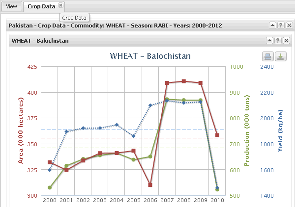
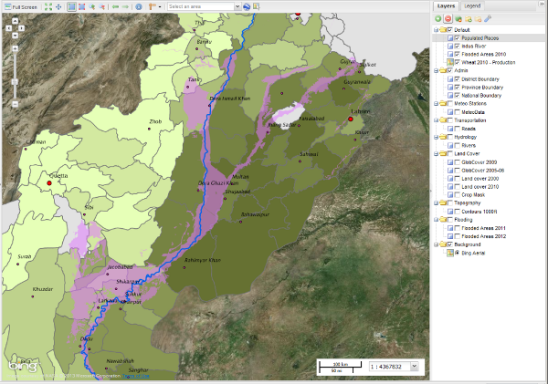

.. module:: cippak.using.crop_data_tool
   :synopsis: How to use Crop Data Tool

.. _cippak.using.crop_data_tool:

.. raw:: latex

  \newpage % hard pagebreak at exactly this position

Crop Data Tool
===========================

This section illustrates how you can use **Crop Data Tool**.

***********************************
Tab to interact with Crop Data Tool
***********************************

**Crop Data Tool** is located in the west of the layout and allows you to generate charts and maps dynamically aggregating yearly data about production, cultivated areas and yield of each crop.

    .. figure:: img/cropdata_tool.png

                Crop Data Tool.

.. raw:: latex

  \newpage % hard pagebreak at exactly this position    

Generate a Chart
^^^^^^^^^^^^^^^^

To generate charts that describes the trend of the wheat production choose "Chart" as output type and select the Season, the Area of interest and the range of years in which you are interested.

1. Select **output type**: Generate time-series charts (Chart):

    .. figure:: img/output_chart.png

        Choose Output Type Chart.

2. Filter available crops by *season* (Rabi or Kharif)

    .. figure:: img/season_choice.png

        Choose Season.

3. Select **area of interest**
    a. Type: Province or District
        i. Add District(s) or Province(s) from list (Add)
        ii. Add District(s) or Province(s) from map (Add from map)
        iii. Delete one or all selected items (Clear)

    .. figure:: img/aoi_choice.png

        Choose Area Of Interest.

.. raw:: latex

  \newpage % hard pagebreak at exactly this position

You can add it clicking on the map (``Add from map``) or on ``Add`` button. In both cases:

    .. figure:: img/output_chart_choices_highlight.png

        Area Of Interest selection.

    The selected AoI is marked on the map.

4. Identify **crop of interest** (wheat (rabi), maize, rice, sugarcane or cotton (kharif))

    .. figure:: img/commodity_choice.png

        Choose Commodity.

5. Select **time interval** for the averaging: highest in the interval is the reference year

    .. figure:: img/range_year_choice.png

        Choose Years Range.

6. Select **variable** to process (only for mapping)

    a) Area; Production; Yield;

.. raw:: latex

  \newpage % hard pagebreak at exactly this position

.7. Define output’s **unit of measures** (currently only default)

    a. tons/bales; ha; kg/ha

8. Press on **generate chart** button.

    .. figure:: img/generate_chart_button.png

        Generate Chart Button.

The chart is going to appear in a new tab: 

    Generated Charts.

.. raw:: latex

  \newpage % hard pagebreak at exactly this position

At the buttom of each chart appear a legend:

    .. figure:: img/output_chart_viewchart_legend.png

        Charts Legend.  

Notes:

* Three lines are plotted: area (red) production (green) and yield (dashed blue);
* For each line there is one dedicated axis, with scale of values and title;
* To check annual values of  area, production and yield, move the mouse over the lines’ markers;
* To temporarily hide single plotted lines, click on the legend at the bottom of the chart. Axes will be also removed;
* The time series depends on the selected time interval. The highest is the reference year;
* Averages values are showed down at the left corner, and are also plotted as dashed horizontal lines;
* Charts resize on browser’s window resizing;
* Two icons on the top right corner of each chart:

    .. figure:: img/chart_opt_1.png

        Charts export.  

 allow to Print or Export to different graphic formats  (raster: PNG, JPEG; or vector: PDF and SVG) the selected chart; 

* The chart container shows three icons:  

    .. figure:: img/chart_opt_2.png

        Charts table options. 

 The content can be collapsed or closed. The info icon allows to get basic information about the chart or group of charts.     

.. raw:: latex

  \newpage % hard pagebreak at exactly this position      

Generate a Map
^^^^^^^^^^^^^^

To generate a map that describes the trend of the rice production choose "Map" as output type and select the Season, the Area of interest and the range of years in which you are interested.

1. Select **Map output type**

    .. figure:: img/output_map.png

        Choose Output Type Map.

2. Select **season**
                
    .. figure:: img/season_choice_map.png

        Choose Season.

3. Choose **Area Of Interest**:

    .. figure:: img/aoi_choice_map.png

        Choose Area Of Interest.

    In this case we're selected **Province**.

.. raw:: latex

  \newpage % hard pagebreak at exactly this position

You can add it clicking on the map (``Add from map``) or on ``Add`` button. In both cases:
                
    .. figure:: img/output_map_choices_highlight.png

        Area Of Interest selection.

    The selected AoI is marked on the map.

4. Choose **Commodity**:

    .. figure:: img/commodity_choice_map.png

        Choose Commodity.

5. Select the **time interval** by using the dedicated slider.

    .. figure:: img/range_year_choice.png

        Choose Years Range.

    On the map generation, the **Inception Year** is the last year of the range.

.. raw:: latex

  \newpage % hard pagebreak at exactly this position

.6. Select the **variable** to map:

    .. figure:: img/variable_choice_map.png

        Choose Variable.   

7. Click on **Generate Map** button:

    .. figure:: img/generate_map_button.png

        Generate Map Button.

    The new layer:

    .. figure:: img/output_map_viewmap_layer.png

        Generated Map Layer.

    appear on the layer tree.

.. raw:: latex

  \newpage % hard pagebreak at exactly this position

And is drawed on the map canvas:

    .. figure:: img/output_map_viewmap.png

        Generated Map.

If you open the legend panel for the layer
                    
    .. figure:: img/smart_map_legend.png

        Generated Map Legend.

you can view the rules and styles applied to the layer.

.. raw:: latex

  \newpage % hard pagebreak at exactly this position

You may drag and drop other thematic layers in the Default group to compose a map and show possible relationships among  different layers. Above is a screenshot of a map composition (choropleth map plus various layers from available in the system).
                

    Map composition.

.. raw:: latex

  \newpage % hard pagebreak at exactly this position

Smart Identification tool
"""""""""""""""""""""""""

This tool allows you to query the map generated by Crop Data Tool. You must first select the generated layer from the Layer Switcher panel.

1. **Select the layer** clicking on it on the layer tree. 

2. Select the **identification tool** that will be enabled at the right side of  the map tool bar (top of map canvas):

    .. figure:: img/smart_map_identification_tool.png

                Smart Map Identification Tool.

3. **Click on** any administrative unit of the **map** and you will display data (popup window) for the reference year, previous year and averages of selected time interval. 

    .. figure:: img/smart_map_identification.png

                Smart Map Identification.

    Note that clicking on boundaries, statistics for the adjacent units will be plotted.
    The icons on the top right corner  

    .. figure:: img/pin.png

                Pin button.

    allow to pin/un-pin the position of the popup window or close it .

.. raw:: latex

  \newpage % hard pagebreak at exactly this position

Generate Tabular data
^^^^^^^^^^^^^^^^^^^^^

This option allows you to generate tabular data and download it as Comma Separated Value (CSV).
This option is enable only for logged in users and it is also available for **Crop Status Tool** and **Agromet Tool**

Click on the login button.

    .. figure:: img/login.png

                Login button.
                
Enter your credential.

    .. figure:: img/login_form.png

                Login Form.
                
If the credentials are ok the option Data is enable in the Output Type radio button.

    .. figure:: img/output_data.png

                Output type Data.

.. raw:: latex

  \newpage % hard pagebreak at exactly this position

To generate tabular data and download it as Comma Separated Value (CSV) of the rice production choose "Data" as output type and select the Season, the Area of interest and the range of years in which you are interested.

Select the season: Rabi or Kharif:

    .. figure:: img/season_choice_map.png

                Choose Season.

Select the Area Of Interest:

    .. figure:: img/aoi_choice_data.png

                Choose Area Of Interest.

.. raw:: latex

  \newpage % hard pagebreak at exactly this position

the selected zones are highlighted on the map:
                
    .. figure:: img/output_map_choices_highlight.png

                Area Of Interest selection.

Note that the red disk icon allows to remove item(s) from the list. Also re-clicking on a shape makes the same shape to be deselected. Additional note, if you want a specific area you do not know where it is but you know its name, you can use the Add (+)  button: an input box for searching the DB pops up. 

Select a commodity:

    .. figure:: img/commodity_choice_map.png

                Choose Commodity.

Select the time interval by using the dedicated slider. It defines the range for averages and the reference year (highest). The default range is the max available. 

    .. figure:: img/range_year_choice.png

                Choose Years Range.

.. raw:: latex

  \newpage % hard pagebreak at exactly this position

Select the factor to analyze. 

    .. figure:: img/variable_choice_map.png

                Choose Variable.                

Click on the ``Generate Data Button`` button

    .. figure:: img/generate_data_button.png

                Generate Data Button.

.. raw:: latex

  \newpage % hard pagebreak at exactly this position

The result is a formatted table (AgroMet Tables near the View tab) of source values.
                
After clicking on the button will open a grid where the information will be listed in tabular form.

    .. figure:: img/generate_tabular_data_grid.png

                Tabular Data Grid.
                
Factor values (e.g. NDVI) are listed by dekad and month. Three columns provide data for reference year, previous and selected time interval (average).  All factors are included in the same table.

Now you can export the data in CSV format and save them on your PC.

If you have selected one or more provinces, you can export the data for only one province or districts belonging to the province.
If you have selected a district can export only the data for the district.

The icon at the bottom right corner  allows the data to be exported as CSV file.

    .. figure:: img/export_data_buttons.png

                Export Data Buttons.

Table container shows four icons

    .. figure:: img/tab_data_buttons.png

                Table icons.

The content can be collapsed or closed. The info icon allows to get basic information about the table (source information).
