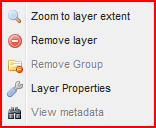
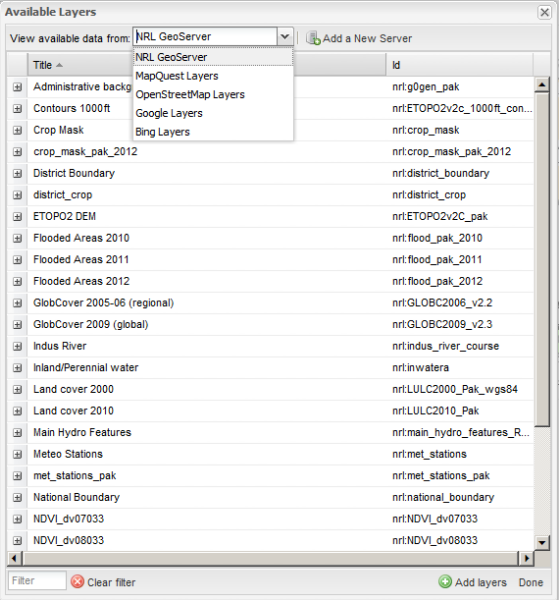
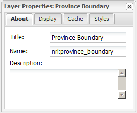
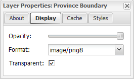

.. module:: cippak.using.layer_tools
   :synopsis: Management of spatial layers 

.. _cippak.using.layer_tools:

.. raw:: latex

  \newpage % hard pagebreak at exactly this position

Layer Tools
===========

This section illustrates the ``Layer Tools`` presents on the layer's panel.

At the top of the panel, you have a button bar to manage the layer tree. Most of this operations appear if you open the context menu for a layer or a layer group

    Context menu

Add
---

    Add layer button

Opens up the WMS Server Management panel (which we are going to describe in the following) which can be used to add new layers to Map Component from the Crop Portal Data Dissemination Server (called NRL GeoServer) or from external WMS Servers

    WMS panel

The panel provides a few additional controls as follows:

* The top drop down box provides a list of preconfigured servers from which layers can be obtained
* The central grid provide information about the layers served by the server selected in the drop down box
* We have an ``Add a New Server`` button in order to allow us to add an additional server (WMS or WMTS) 
* We have the button in the bottom right corner to either add to the current map the selected layer from the selected server or to close the panel itself
* We also have the capabilities to filter the layers’ grid via a text box at the bottom left corner. The  ``Clear Filter`` button can be used to remove any filtering

.. raw:: latex

  \newpage % hard pagebreak at exactly this position

Remove
------

.. figure:: img/remove.png

    Remove layer

Can be used to remove the currently selected layers in the tree. It is worth to point out that background layers cannot be removed.

Remove all
----------

    Remove al layers

Can be used to remove all layers, except the background layers, from the tree.

.. raw:: latex

  \newpage % hard pagebreak at exactly this position

Add layer group
---------------

    Add a layer group

Can be used to add a new layer group to the tree

Remove group
------------

    Remove a layer group

Can be used to remove the selected layer group from the tree

.. raw:: latex

  \newpage % hard pagebreak at exactly this position

Layer properties
----------------

    Layer properties

Can be used to open up the Layer Property Window to show all the properties of the selected layer as well as to set some of them like the style used to visualize it or the format used for requesting.

Layer properties window
+++++++++++++++++++++++

The Layer Property Window is composed by a certain number of tabs as follows:

**About**, which provide additional descriptive information about the selected layer

    About tab

.. raw:: latex

  \newpage % hard pagebreak at exactly this position

**Display**, which can be used to control the opacity and the format of the selected layer

    Display tab

**Cache**, which can be used to disable client side (browser based) caching of the selected layer

.. raw:: latex

  \newpage % hard pagebreak at exactly this position

**Styles**, which can be used to control which style we use to show the selected layer on the map as well as to inspect the relative legend

	.. figure:: img/styles.png

	    Styles tab
